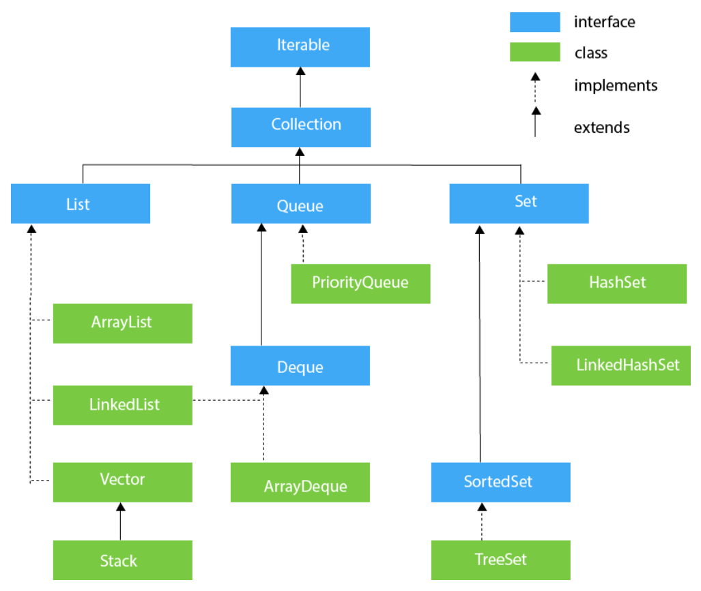

# 개요

## 동기

 평소 Collection의 상속 관계에 대해 완전히 알지 못한 채 ArrayList, LinkedList, HashMap 등을 사용하였습니다. 그러다가 프레임워크에 대해 코딩테스트 문제 해결 중 Queue를 사용할 일이 있었는데 Queue가 LinkedList로 구현되었다는 것을 알게되어 이번 기회에 Collection에 대해 정리해보았습니다.

## Collection

 Collection은 자바에서 제공하는 프레임워크로, 객체들을 저장하는 다양한 클래스와 이들의 사용 방법을 정의한 인터페이스들을 제공합니다.

# Hierarchy of Collection framework

 Collection의 계층 구조는 다음과 같습니다.

이미지 출처: [https://www.javatpoint.com/collections-in-java](https://www.javatpoint.com/collections-in-java)

# Collection 인터페이스의 메서드

| 메서드               | 설명 |
| -------------------- | ---- |
| public boolean (E e) |      |
|                      |      |
|                      |      |
|                      |      |
|                      |      |
|                      |      |
|                      |      |
|                      |      |
|                      |      |
|                      |      |
|                      |      |
|                      |      |
|                      |      |
|                      |      |
|                      |      |
|                      |      |
|                      |      |
|                      |      |
|                      |      |

# 참고한 문서들

- [https://www.javatpoint.com/collections-in-java](https://www.javatpoint.com/collections-in-java)