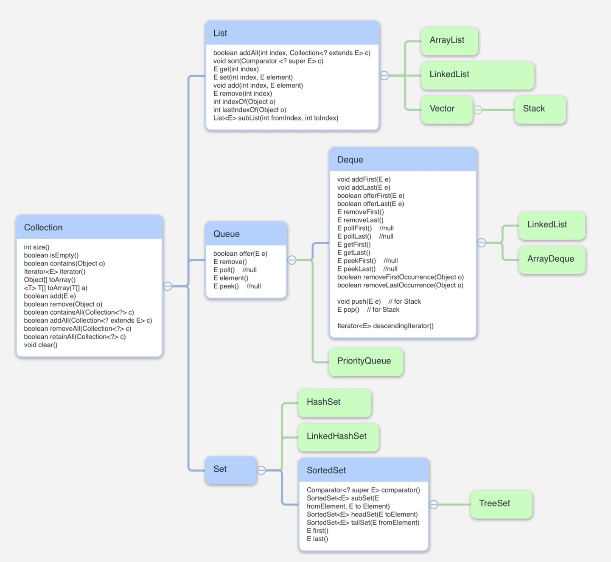

# 개요

 Collection은 자바에서 제공하는 프레임워크로, 객체들을 저장하는 다양한 클래스와 이들의 사용 방법을 정의한 인터페이스들을 제공합니다.

  

# Hierarchy of Collection framework

 Collection의 계층 구조는 다음과 같습니다.

기존 https://www.javatpoint.com/collections-in-java 에서 가져온 이미지에서 직접 마인드맵으로 작성한 이미지로 대체하였습니다.

Java Collection, List, Queue, Deque, Set, SortedSet interface 를 참고하여 제작하였습니다.

  

# Methods of Collection interface

더 많은 메서드들이 있지만, 몇 개는 생략하고 코딩테스트에서 주로 활용하는 메서드만 정리하였습니다.

| Method                                    | Description                               |
| ----------------------------------------- | ----------------------------------------- |
| int size()                                | 원소의 수 반환                            |
| boolean isEmpty()                         | 배열이 비어있는지를 반환                  |
| boolean contains(Object o)                | 해당 원소가 있는지를 반환                 |
| Iterator iterator()                       | iterator 반환                             |
| Object[] toArray()                        | 배열로 반환                               |
| \<T> T[] toArray(T[] a)                   | T의 배열로 반환                           |
| boolean add(E e)                          | 원소 추가                                 |
| boolean remove(Object element)            | 특정 원소 제거                            |
| boolean addAll(Collection<? extends E> c) | c에 있는 모든 원소 추가                   |
| boolean removeAll(Collection <?> c)       | c에 있는 원소들과 일치하는 모든 원소 제거 |
| boolean retainAll(Collection <?> c)       | c에 있는 원소들을 제외한 모든 원소 제거   |
| void clear()                              | 모든 원소 삭제                            |

  

# 같이 보면 좋은 포스트

* [Map](../java_map)
* [Collection - List](../java_collection_list)
* [Collection - Queue](../java_collection_queue)
* [Collection - Set](../java_collection_set)

# 참고한 문서들

- java.util 패키지 내 Collection, List, Queue, Deque, Set, SortedSet 자바 파일들
- 📄 [https://www.javatpoint.com/collections-in-java](https://www.javatpoint.com/collections-in-java)