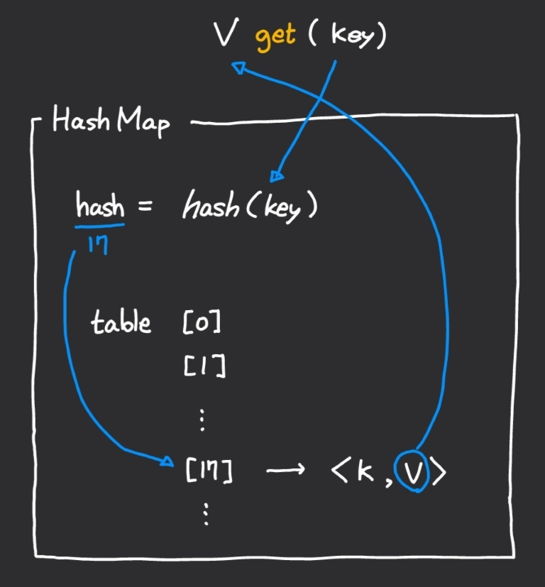

# 개요

AbstractMap에 구현 된 <span style="color:orange">get</span> 메서드는 기본적으로 Iterator를 이용하여 entrySet을 처음부터 하나씩 조회합니다.

이 알고리즘을 사용한다면 키를 이용하여 값을 조회하는데 O(n) 시간이 걸립니다. HashMap은 키를 이용한 값 조회시간을 단축시키기 위해 사용되는 Map 인터페이스를 구현한 Java API 입니다. HashMap을 이용하면 값을 조회하는데 보통 O(1) 시간이 걸립니다.

<br><br>

# Hash function

해시 함수는 임의의 길이를 갖는 임의의 데이터를 고정된 길이의 데이터로 매핑하는 함수를 말합니다.

쉽게 설명하면, Java의 HashMap은 각 객체의 Map 인터페이스에 정의된 `int hashCode()` 메서드가  반환하는 값을 사용하여 배열처럼 값을 조회합니다.




hashCode()의 반환형은 int이므로 이론상 최대 2^32개 이하의 키 객체는 완전해시함수를 이용해 중복없이 저장할 수 있습니다. 하지만 키 객체의 개수가 2^32를 초과하거나, 서로 다른 객체임에도 hashCode()를 통해 생성된 해시값이 동일한 경우는 해시 충돌이 발생하게 됩니다. 해시 충돌에 대해서 더 궁금하시다면 같이보면 좋은 문서들의 "Java HashMap은 어떻게 동작하는가?"를 참고해주세요.

<br><br>

# hashCode, equals 메서드 재정의

위에서 언급한 hashCode() 메서드는 각 객체에서 재정의할 수 있습니다.

학번과 이름을 필드로 가지는 다음과 같은 객체가 있다고 해보겠습니다.

```java
class Student{
	public int sno;
	public String name;
    
    public Student(int sno, String name){
        this.sno = sno;
        this.name = name;
    }
}
```

다음과 같이 학생 객체와 매핑되는 수학 점수를 HashMap으로 저장하고 싶습니다.

```java
HashMap<Student, Integer> hashMap = new HashMap<>();
hashMap.put(new Student(12, "철수"), 80);
hashMap.put(new Student(12, "철수"), 95);		//철수의 점수 업데이트
```

제가 의도한대로 철수의 점수가 업데이트 되었을까요?

두 번의 put에서 생성한 객체의 주소가 다르기 때문에 업데이트 되지 않고 각각 따로 저장되었습니다.


이러한 문제점을 해결하기 위해 equals() 메서드와 hashCode() 메서드를 재정의 할 수 있습니다.

```java
@Override
public int hashCode(){
    return sno + name.hashCode();
}

@Override
public boolean equals(Object obj){
    if(obj instanceof Student){
        Student student = (Student) obj;
        return (sno==student.sno) && (name.equals(student.name));
    }
    else{
        return false;
    }
}
```

위와 같이 Student 클래스 내에 hashCode와 equals를 재정의하여 같은 객체로 보고 값을 업데이트하도록 할 수 있습니다.

<br><br>

# 관련 코테 문제들

- 프로그래머스: 완주하지 못한 선수 (Lv.1) [[링크]](https://programmers.co.kr/learn/courses/30/lessons/42576)
- 프로그래머스: 오픈채팅방 (Lv.2) [[링크]](https://programmers.co.kr/learn/courses/30/lessons/42888)

<br><br>

# 참고한 문서들

1. 📄Java HashMap은 어떻게 동작하는가? [[링크]](https://d2.naver.com/helloworld/831311)
2. 📖신용권, 『혼자 공부하는 자바』