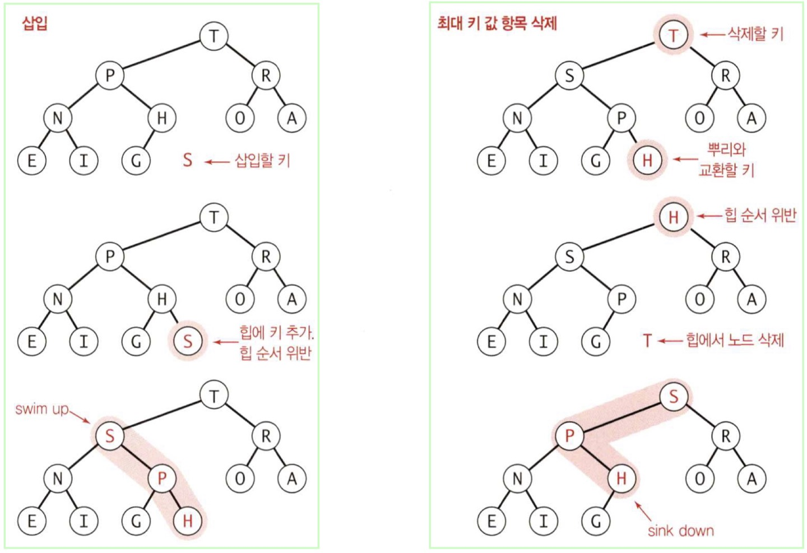

# 개요

 코딩테스트에서 Heap을 사용할 일이 꽤 많이 있습니다. Java에서는 이를 PriorityQueue로 풀 수 있습니다. IDE 환경에서는 자동완성 등의 기능을 지원하기 때문에 쉽게 사용할 수 있지만, 실제 코딩 테스트를 볼 때는 이러한 기능 없이 구현할 줄 알아야 하는 경우가 종종 있습니다.

 따라서, PriorityQueue 의 기본적인 메소드들을 정리함과 동시에 평소 헷갈렸던 Comprable, Comparator 도 함께 정리하겠습니다.

<br><br>

# PriorityQueue Methods

Collection interface 에서 공통으로 사용하는 메서드들은 java-collection 포스팅을 참고해주세요.

| Method                | Description                                            |
| --------------------- | ------------------------------------------------------ |
| boolean add(object)   | 원소 추가                                              |
| boolean offer(object) | 원소 추가                                              |
| Object remove()       | 가장 앞에 있는 원소 삭제 후 반환                       |
| Object poll()         | 가장 앞에 있는 원소 삭제 후 반환. 비어있다면 null 반환 |
| Object element()      | 가장 앞에 있는 원소 확인                               |
| Object peek()         | 가장 앞에 있는 원소 확인. 비어있다면 null 반환         |

<br><br>

# Comparable

클래스가 정렬 기준을 가지고 있을 경우 사용합니다.

예시 코드입니다. class Job 내의 jobTime 을 기준으로 정렬하고 싶을 경우 다음과 같습니다.

```java
class Job extends Comparable<Job>{
    final int requestTime;
    final int jobTime;

    public Job(int requestTime, int jobTime) {
        this.requestTime = requestTime;
        this.jobTime = jobTime;
    }
    
    @Override
    public int compareTo(Job o){
        return ((Integer) jobTime).compareTo(o.jobTime);
    }
}
```

<br><br>

# Comparator

익명 함수 형태로 구현할 수 있습니다. (꼭 익명 형태가 아니여도 됩니다)

```java
class Job {
    final int requestTime;
    final int jobTime;

    public Job(int requestTime, int jobTime) {
        this.requestTime = requestTime;
        this.jobTime = jobTime;
    }
}

class SortTest {
    List<Job> jobs = new ArrayList<>();
    
    public void sortTest(){
        Collections.sort(jobs, new Comparator<Job>() {
            @Override
            public int compare(Job o1, Job o2){
                return ((Integer) jobTime).compareTo(o.jobTime);
            }
        });
    }
}

class PriorityQueueTest {
    Queue<Job> jobs = new PriorityQueue<>(new Comparator<Job>(){
            @Override
            public int compare(Job o1, Job o2){
                return ((Integer) jobTime).compareTo(o.jobTime);
            }        
    });
}
```

<br><br>

# 추가 - Heap 자료구조

따로 포스팅을 하기엔 양이 적어 이 포스트에 추가로 Heap 자료구조에서 원소 삽입과 삭제 방법에 대한 이미지를 간단하게 첨부하겠습니다.



출처 : 로버트 세지웍, 케빈 웨인, 『알고리즘 개정 4판』, 317p

<br>

실제 PriorityQueue.java 내에서는 swim up 과 sink down 을 siftUp 과 siftDown 메소드로 구현하고 있습니다.

<br><br>

# 참고한 문서

* 📄 [https://www.javatpoint.com/java-priorityqueue](https://www.javatpoint.com/java-priorityqueue)
* 📄 [https://includestdio.tistory.com/35](https://includestdio.tistory.com/35)
* 📘 로버트 세지웍, 케빈 웨인, 『알고리즘 개정 4판』
