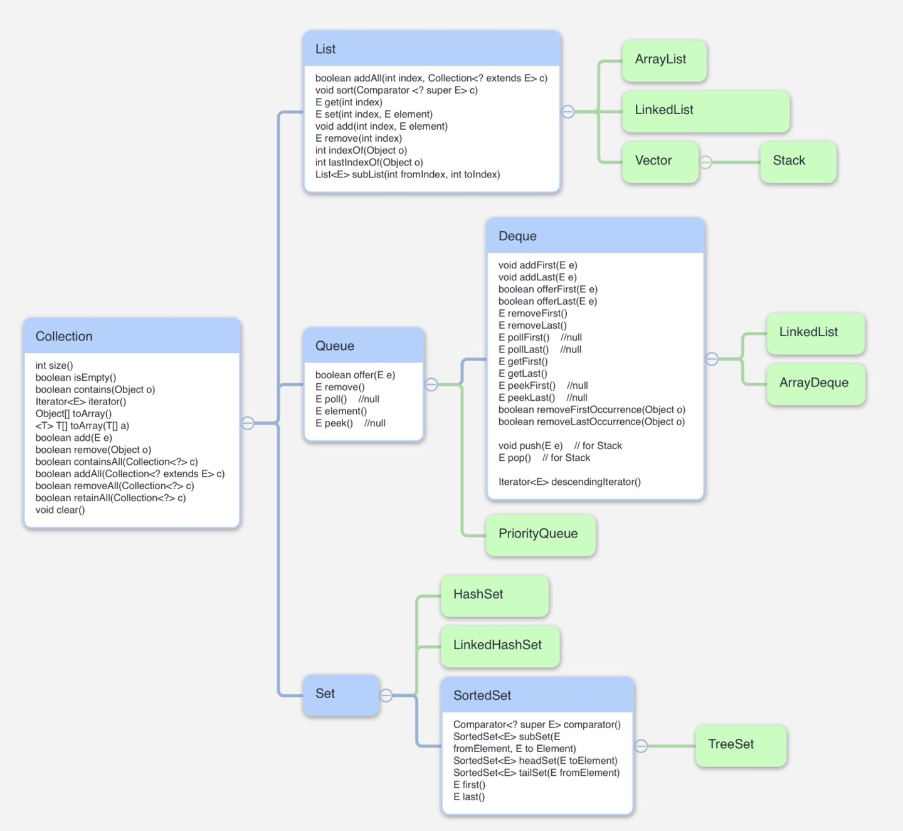

# 개요

## Hierarchy of Collection

  

# Methods of SortedSet interface

 Set interface 의 메소드는 Collection 에서 정의된 것을 대부분 사용하고 있어 생략하였습니다. SortedSet 의 메소드는 Set 메소드에서 추가된 메소드들입니다.

| Method                                           | Description                                                  |
| ------------------------------------------------ | ------------------------------------------------------------ |
| Comparator<? super E> comparator()               | set 을 정렬하는데 사용하는 Comprator 를 반환. 기본 조건이라면 null |
| SortedSet\<E> subSet(E fromElement, E toElement) | fromElement 이상, toElement 미만의 sub SortedSet 반환        |
| SortedSet\<E> headSet(E toElement)               | 처음부터 toElement 미만의 sub SortedSet 반환                 |
| SortedSet\<E> tailSet(E fromElement)             | fromElement 부터 마지막까지의 sub SortedSet 반환             |
| E first()                                        | 첫 번째 원소 반환                                            |
| E last()                                         | 마지막 원소 반환                                             |

  

# 같이 보면 좋은 포스트

* [Collection](../java_collection)
* [Collection - List](../java_collection_list)
* [Collection - Queue](../java_collection_queue)

  

# 참고한 문서

* java.util 패키지 내 Set.java, SortedSet.java
