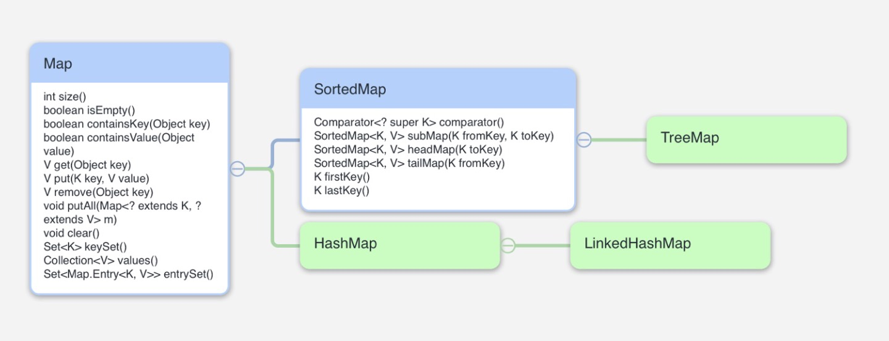

# 개요

 Map 컬렉션은 키(key)와 값(Value)로 구성된 `Entry<K, V>` 객체를 저장하는 구조입니다.

키는 중복 저장을 허용하지 않지만 값은 중복 저장을 허용합니다. 따라서 기존에 저장된 키와 동일한 키로 새로운 값을 저장하면 기존 값은 없어지고 새로운 값으로 대체됩니다.

  

# Hierarchy of Map

  

# Entry Interface

 Map 컬렉션은 키(key)와 값(Value)로 구성된 `Entry<K, V>` 객체를 저장하는 구조입니다. 따라서 Map 내에는 Entry 라는 interace 가 정의되어 있습니다. 이 Entry 의 메소드를 간략하게 설명드리고 Map 과 SortedMap 의 메소드를 소개하겠습니다.

## Methods of Entry

| Method              | Description                                   |
| ------------------- | --------------------------------------------- |
| K getKey()          | key 를 반환                                   |
| K getValue()        | value 를 반환                                 |
| V setValue(V value) | 기존의 value 를 입력으로 들어온 value 로 대체 |

  

# Methods of Map interface

| Method                                       | Description                               |
| -------------------------------------------- | ----------------------------------------- |
| int size()                                   | 총 Entry 수를 반환                        |
| boolean isEmpty()                            | map 이 비어있는지를 반환                  |
| boolean containsKey(Object key)              | map 내에 해당 key 가 있는지 반환          |
| boolean containsValue(Object value)          | map 내에 해당 value 가 있는지 반환        |
| V get(Object key)                            | key 로 특정되는 value 를 반환             |
| V put(K key, V value)                        | Entry 하나를 map 에 삽입                  |
| V remove(Object key)                         | key 로 특정되는 Entry 하나를 제거         |
| void putAll(Map<? extends K, ? extends V> m) | 입력으로 주어진 Map m 을 기존 맵에 삽입   |
| void clear()                                 | map 을 초기화                             |
| Set\<K> keySet()                             | 모든 key 를 포함하는 Set 을 반환          |
| Collection\<V> values()                      | 모든 value 를 포함하는 Collection 을 반환 |
| Set\<Map.Entry<K, V>> entrySet()             | 모든 Entry 를 포함하는 Set 을 반환        |

  

# Methods of SortedMap interface

| Method                                     | Description                                                  |
| ------------------------------------------ | ------------------------------------------------------------ |
| Comparator<? super K> comparator()         | map 을 정렬하는데 사용하는 Comprator 를 반환. 기본 조건이라면 null |
| SortedMap<K, V> subMap(K fromKey, K toKey) | fromKey 이상 toKey 미만에 있는 sub SortedMap 을 반환         |
| SortedMap<K, V> headMap(K toKey)           | toKey 미만에 있는 sub SortedMap 을 반환                      |
| SortedMap<K, V> tailMap(K fromKey)         | fromKey 이상에 있는 sub SortedMap 을 반환                    |
| K firstKey()                               | 첫 번째 key 를 반환                                          |
| K lastKey()                                | 마지막 key 를 반환                                           |

  

# 같이 보면 좋은 포스트

* [Collection](../java_collection)
* [Map - HashMap](../java_map_hashmap)

  

# 참고한 문서

* java.util 패키지 내 Map.java, SortedMap.java
