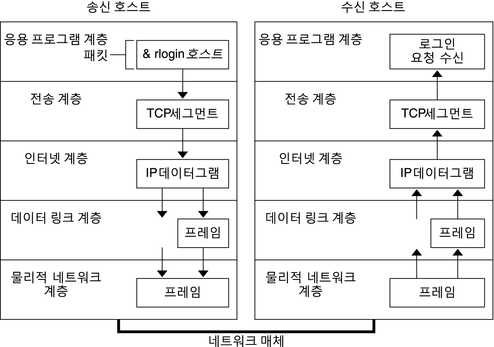

# 개요

동기 접기/펼치기

네트워크에 대해 얕고 넓은 수준으로 알고 있었지만, 백엔드 개발자를 꿈꾸는 사람으로서 웹 프레임워크(특히 Spring)의 구조를 정확하게 이해하기 위해서 네트워크 관련 지식은 필수라는 생각이 듭니다. 따라서 제가 명확히 알지 못했던 내용들, 모르는 내용들을 정리하여 포스팅할 계획입니다.

 앞으로의 포스팅에서 James F. Kurose, Keith W.Ross의 『컴퓨터 네트워킹 하향식 접근』 한글 번역서를 기준으로 공부하고 배운 것을 정리할 것입니다.

# 프로토콜 계층화

 네트워크 통신을 하는 궁극적인 목표는 애플리케이션끼리 데이터를 주고 받는 것입니다. 한 호스트의 애플리케이션에서 다른 호스트의 애플리케이션으로 데이터를 전달하는 과정에서 여러 프로토콜을 거치게 됩니다. 이러한 프로토콜들을 모듈화하여 관리하면 다양한 이점들이 있습니다. 특정 부분을 변경해야할 경우 해당 부분이 속해있는 모듈에 대해서만 신경쓰면 되기 때문에 수정 및 관리가 쉽습니다. 이러한 이유에서 여러 일련의 인터넷 프로토콜들을 다음 그림과 같이 계층적 구조로 설계하였습니다.

 

이미지 출처: [https://docs.oracle.com/cd/E38901_01/html/E38894/ipov-29.html](https://docs.oracle.com/cd/E38901_01/html/E38894/ipov-29.html)

 5개의 계층에서 한 계층은 상위 계층에 제공하는 서비스에 대해서만 신경쓰면 되고, 이를 **서비스 모델(Service model)**이라고 합니다. 한 예로, 전송(Transport) 계층 프로토콜 중 TCP 프로토콜이 있고 이를 통해 전달 보장과 흐름제어를 애플리케이션 계층에 제공합니다.

# 애플리케이션 계층

 애플리케이션 계층은 애플리케이션 계층 프로토콜과 네트워크 애플리케이션이 있습니다. 애플리케이션 계층 프로토콜은 HTTP, SMTP, FTP 등이 있고 해당 규칙에 따라 전달 받은 정보를 네트워크 애플리케이션이 다루게 됩니다. 설명을 위하여 앞으로의 포스팅에서의 용어를 통일할 필요가 있습니다. 제가 참고한 책의 용어에 따르면, 애플리케이션 계층에서 이 정보 패킷을 **메시지(message)**라고 부릅니다.

# 트랜스포트 계층

  인터넷의 트랜스포트 계층은 클라이언트와 서버 간에 애플케이션 계층 메시지를 전송하는 서비스를 제공합니다. 인터넷에서는 다음 두 가지 프로토콜을 사용하고 있습니다.

- TCP
  - 연결지향형 서비스
  - 메시지 전달 보장
  - 흐름제어(송신자/수신자의 속도 일치)
  - 긴 메시지를 짧은 메시지로 나누고 혼잡제어 기능 제공
- UDP
  - 비연결형 서비스
  - 신뢰성, 흐름제어, 혼잡제어를 제공하지 않음
  - 실시간 스트리밍 등에서 사용

트랜스포트 계층의 패킷을 **세그먼트(segment)**라고 부릅니다.

# 네트워크 계층

 인터넷의 네트워크 계층은 한 호스트에서 다른 호스트로 **데이터그램(datagram)**을 라우팅하는 책임을 가집니다. 인터넷에서 IP 프로토콜을 사용하고 있습니다. 라우팅은 여러 방법을 통해 이루어질 수 있으며 이러한 많은 라우팅 프로토콜 또한 네트워크 계층에 포함되지만, IP가 인터넷을 함께 묶는 중요한 역할을 하므로 흔히 IP 계층으로 불립니다.

# 링크 계층

 네트워크 계층에서 호스트와 호스트간 라우팅을 제공한다고 하였습니다. 호스트와 호스트 사이에는 여러 노드들이 있는데 이 중 한 노드에서 다른 노드로 패킷을 전달하는 것을 링크 계층에서 담당합니다. 링크 계층 프로토콜에는 이더넷, 와이파이, 케이블 접속 네트워크의 DOCSIS 등이 있습니다. 라우팅 경로에서 여러 노드들이 있으므로 패킷을 전달하는 과정에서 여러 링크 계층 프로토콜이 사용될 수 있습니다. 링크 계층의 패킷을 **프레임(frame)**이라고 합니다.

# 물리 계층

 물리 계층의 기능은 프레임 내부의 각 **비트**를 한 노드에서 다음 노드로 이동하는 것입니다. 이 계층의 프로토콜들은 링크에 의존하고 더 나아가 링크의 실제 전송 매체에 의존합니다.
