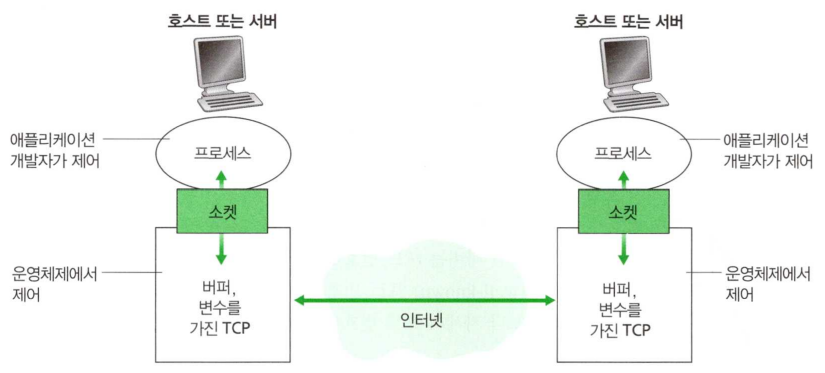

# 개요

네트워크 애플리케이션은 컴퓨터 네트워크의 존재 이유입니다. 즉, 컴퓨터 네트워크는 어떻게 애플리케이션끼리 데이터를 주고 받을까? 라는 고민에서 출발합니다. 애플리케이션 계층의 프로토콜들을 알면 하위 계층을 이해하는데 도움이 되고 동기부여도 된다고 저자는 설명합니다.

 앞으로 이 글을 포함한 6개의 포스팅을 통해 인터넷 네트워크 계층 중 애플리케이션 계층에 대해 다룰 것입니다.

1. 네트워크 애플리케이션의 원리
2. 웹과 HTTP
3. 전자메일
4. DNS
5. P2P 파일 분배
6. 비디오 스트리밍과 컨텐츠 분배 네트워크

# 구조

 네트워크 애플리케이션을 개발할 때 고려해야할 구조입니다. 현대에서는 주로 클라이언트-서버 구조와 P2P 구조 2가지의 선택지가 있습니다.

## 클라이언트-서버 구조

 항상 켜져 있는 호스트를 서버(Server), 서버로 요청을 보내는 호스트를 클라이언트(Client)라고 부릅니다. 서버는 고정 IP를 가지고 있어 누구든 이 IP를 알고 있는 클라이언트는 언제든 서버로 요청을 보내고 서버로부터 응답을 받을 수 있습니다.

 서버로 요청하는 클라이언트 수가 매우 많아지면 하나의 서버로는 모든 요청에 대해 응답하는 것이 불가능해집니다. 이러한 이유로 많은 수의 호스트를 갖춘 데이터 센터를 설치하고 로드 밸런싱을 통해 부하를 분산시킵니다.

 이러한 구조를 채택하는 애플리케이션의 종류는 웹, 파일 전송, 원격 로그인, 전자메일 등이 있습니다. 검색엔진(구글, 네이버), 인터넷 상거래(아마존, 이베이), 웹 기반 전자메일(지메일), 소셜 네트워킹(페이스북, 인스타그램, 트위터) 등이 여기에 속합니다.

## P2P 구조

 P2P 구조에서는 항상 켜져있는 서버에 최소로 의존하거나 혹은 전혀 의존하지 않습니다. 대신에 피어(peer)라는 호스트 쌍이 직접 통신하는 구조입니다. 특정 서버를 통하지 않고 피어끼리 통신하므로 P2P, peer-to-peer 라고 합니다.

 P2P 구조의 장점 중 하나는 **자기 확장성**입니다. P2P 방식의 대표적인 애플리케이션인 토렌트를 예로 들어 설명해보겠습니다. A가 특정 파일을 소유하고 있는 상태에서 B가 A의 파일을 다운받기를 원합니다. A와 B는 P2P 구조로 서로 연결되어 직접 파일을 전송하고 B도 이 파일을 소유하게 되었습니다. 나중에 새로운 C가 이 파일을 다운받기 원할 때는 A, B 둘 다 이 파일을 제공하는 서버가 될 수 있습니다. 이러한 자기 확장성이라는 특성 때문에 A 혼자 엄청난 양의 트래픽을 감당할 수 있는 장비를 구축하지 않아도 쉽게 많은 사람에게 파일을 공유 할 수 있습니다.

 장점도 있지만 단점도 있습니다. 인증된 서버를 통해 통신하는 것이 아닌 개인간 직접 통신하는 구조로 인해 보안, 신뢰성에 대한 문제가 발생할 수 있습니다.

 이러한 구조를 채택하는 애플리케이션의 종류는 파일 공유, 피어-지원 다운로드 가속기, 인터넷 전화 및 비디오 컨퍼런스 등이 있습니다. 비트토렌트(BitToreent), 쉰레이(Xunlei), 스카이프 등이 여기에 속합니다.

# 프로세스 간 통신

## 통신의 주체

 지금까지는 애플리케이션이라는 용어를 사용했지만, 실제로 통신이 이루어지는 것은 프로세스 단위입니다. 서로 다른 호스트의 프로세스끼리 통신하는 것이 컴퓨터 네트워크의 주된 목적입니다. 프로세스끼리 통신이 어떻게 이루어지는지 간략하게 살펴보겠습니다.

## 소켓

이미지 출처: James F. Kurose, Keith W.Ross, 『컴퓨터 네트워킹 하향식 접근』, 81p

 

 프로세스는 소켓을 통해 네트워크로 메시지를 주고 받습니다. 프로세스(혹은 애플리케이션 개발자) 입장에서는 소켓으로 메시지를 보내는 것에만 집중하면 되고, 그 뒤로 어떻게 상대 소켓에 도달하는지 신경쓰지 않아도 됩니다. 즉, 소켓은 애플리케이션 계층과 트랜스포트 계층 간의 인터페이스이면서 애플리케이션-네트워크(인터넷) 사이의 API(Application Programming Interface) 입니다.

 호스트를 특정하는데 IP를 사용한다는 것은 잘 알고 있습니다. 해당 호스트의 특정 프로세스(소켓)는 어떻게 찾아갈까요? 이 소켓을 식별해 주는 것이 포트 번호 입니다. 즉, 목적지의 IP, 포트 번호만 알면 해당 호스트 내 프로세스를 찾아가 메시지를 전달할 수 있는 것입니다. 인기 있는 애플리케이션은 약속으로 특정 포트 번호가 할당됩니다. 예를 들어 웹 서버는 80번 포트, 메일 서버는 포트 번호 25 등이죠.

# 트랜스포트 서비스 선택 시 고려요소

 트랜스포트 계층은 애플리케이션 계층에게 서비스를 제공하기 위해 존재합니다. 네트워크 애플리케이션 개발자는 다음의 고려사항들을 보고 어떤 서비스(프로토콜)를 선택하면 좋을지 고민해보아야합니다.

- **신뢰적 데이터 전송**
  - 손실 미허용
  - 손실 허용 (어느정도의 손실이 있어도 큰 상관이 없을 때)
- **처리량**
  - 대역폭 민감 (단위 시간 당 일정량의 데이터 전송이 반드시 이루어져야하는 경우)
  - 탄력적
- **보안**

 이 밖에도 **시간**(내가 보낸 메시지는 특정 시간 안에 도달해야해)도 중요한 고려요소이기는 하지만 아쉽게도 현대 인터넷은 시간 혹은 대역폭을 보장해주지 못합니다. 이것을 고려해 개발자들이 애플리케이션을 잘 설계하지만, 그럼에도 과도한 지연이 있을 때에는 어쩔 수 없이 제대로 된 서비스를 제공하지 못할 때도 있습니다.

# 트랜스포트 계층 프로토콜

 위의 조건들을 고려하여 선택할 수 있는 트랜스포트 계층 프로토콜은 2가지가 있습니다.

## TCP

 TCP(Transmission Control Protocol)는 연결지향형이며 신뢰적인 데이터 전송 서비스를 제공합니다.

#### 연결 지향형

 메시지를 전송하기 전에 클라이언트와 서버가 전송 제어 정보를 교환하는 과정을 3-way-handshake라고 합니다. handshaking이 끝나면 연결이 되었다는 것이 확인되고 교환하고자 했던 메시지를 모두 교환한 후에는 연결을 끊습니다.

#### 신뢰적인 데이터 전송

 TCP는 애플리케이션에서 전송하는 메시지를 손실 없이, 중복 없이, 올바른 순서로 전달하는 것을 보장합니다.

#### 혼잡 제어 방식

 TCP는 프로세스의 직접 이득보다 인터넷 전체 성능 향상을 위해 속도를 조절합니다.

 

## UDP

 UDP(User Datagram Protocol)는 간단한 전송 프로토콜입니다. 비연결형, 비신뢰적인 데이터 전송을 합니다. TCP에서 설명한 특성들과 반대 특성을 가지고 있습니다. 인터넷 전화, 실시간 스트리밍 등 약간의 데이터 손실이 있더라도 큰 문제가 없는 경우에 주로 사용합니다.

# 네트워크 애플리케이션

 수많은 네트워크 애플리케이션들이 존재합니다. 당연히 모든 애플리케이션들을 다루는 것은 불가능하고, 이 책에서 다루는 중요한 애플리케이션 5가지를 정리할 것입니다. 웹, 전자 메일, DNS, P2P, 비디오 스트리밍입니다. 특히 백엔드 개발자를 꿈꾸고 있으니 웹(HTTP 프로토콜)에 대해서 좀 더 자세하게 정리하도록 하겠습니다.

# 참고한 문서들

- 📘James F. Kurose, Keith W.Ross, 『컴퓨터 네트워킹 하향식 접근』
