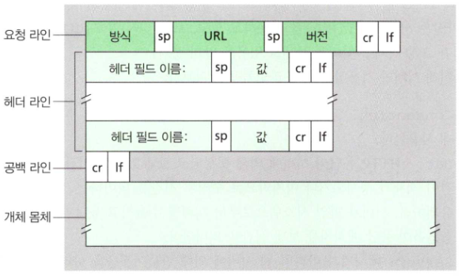
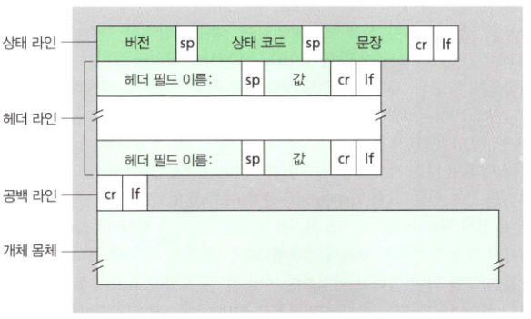
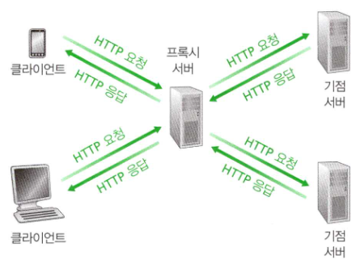

# HTTP 개요

 HTTP는 웹의 중심 프로토콜입니다. 클라이언트와 서버는 HTTP 메시지를 교환하여 통신합니다. HTTP에서는 메시지의 구조 및 교환 방식에 대해 정의하고 있습니다.

## 객체

 단일 URL로 지정할 수 있는 하나의 파일입니다. 여기에는 HTML 파일, JPEG, GIF 등의 이미지 파일, 자바 애플릿, 오디오 클립 등이 모두 포함됩니다.

## 서버와 클라이언트

 서버는 위에서 설명한 여러 객체들을 가지고 있습니다. 클라이언트에서 요청이 올 때 해당 객체들을 HTTP 프로토콜에 따라 클라이언트에 응답해줍니다. 클라이언트는 주로 웹 브라우저를 사용하여 서버에 요청을 합니다. 크롬, 엣지, 파이어폭스 같은 애플리케이션들이 웹 브라우저에 속합니다. 웹 브라우저는 서버로부터 받은 HTTP 응답을 사용자가 보기 좋은 형태로 보여주며 여러가지 웹서핑 도구들을 제공합니다.

## 소켓

 이전 포스트에서 설명한 바와 같이, 웹 역시 소켓을 통해 통신합니다. 클라이언트는 HTTP 프로토콜에 따라 작성된 메시지를 소켓에 전송하고, TCP를 통해 서버의 소켓에 도달하면 서버는 소켓으로부터 HTTP 메시지를 수신합니다. 이후 해당 요청에 따른 응답을 HTTP 형식에 맞추어 생성하고 이를 소켓에 보내면 TCP를 통해 클라이언트의 소켓에 도달하고 클라이언트는 소켓을 통해 응답을 받습니다.

## Stateless

 HTTP는 비상태 프로토콜(Stateless protocol)이라고 불립니다. 서버는 고정 IP를 가지고 무수히 많은 클라이언트에게 요청을 받기 때문에 클라이언트 개개인의 상태를 기억하지 않습니다. 다시말해, HTTP 프로토콜로는 서버가 클라이언트의 상태를 저장하지 않습니다. 그렇다면 어떻게 로그인 유지, 장바구니 등 사용자의 상태를 기억하게 할까요? 이는 뒤에서 쿠키에 대해 다루면서 설명드리겠습니다.

  

# 비지속, 지속 연결

 이전 포스트에서 TCP의 연결지향형 특성과 3-way-handshaking에 대해 설명드린 바 있습니다. 한번 더 간단히 정리하자면 클라이언트와 서버 사이에 우선 연결을 확립하는 과정을 거친 뒤 메시지를 주고 받고, 다 주고받은 후 연결을 끊는 것인데요. 여러 번의 요청과 응답이 있을 경우 `연결 - 요구 - 응답 - 끊기` 의 과정을 여러 번 반복하는 것을 **비지속 연결**이라고 합니다. 이와는 다르게 `연결 - 요구(1) - 응답(1) ... 요구(n) - 응답(n) - 끊기` 처럼 한 번의 연결에 여러 요구 응답을 처리하는 것을 **지속 연결**이라고 합니다.

  

# HTTP 메시지 포맷

## 요청 메시지 포맷

이미지 출처: James F. Kurose, Keith W.Ross, 『컴퓨터 네트워킹 하향식 접근』, 95p

 

요청 메시지의 일반적인 포맷은 위의 사진과 같습니다. CR(carriage return)과 LF(line feed)로 각 줄이 구분됩니다. 방식 필드에 들어갈 수 있는 값은 GET, POST, HEAD, PUT, DELETE 등이 있지만 실제 자주 사용되는 것은 GET과 POST 입니다. 헤더 필드에 들어갈 수 있는 값들은 다양합니다. 비지속 혹은 지속 연결을 할지, 언어는 무엇을 사용할지 등 여러 속성 값들을 담아 보낼 수 있습니다. 몸체(body)부분은 필요에 따라 있거나 없을 수도 있습니다. 주로 POST 방식에서 사용자가 폼에 입력한 값들을 실어 보낼 수 있습니다. (물론 해당 값들을 url에 넣어 GET방식으로 요청할 수도 있습니다)

## 응답 메시지 포맷

이미지 출처: James F. Kurose, Keith W.Ross, 『컴퓨터 네트워킹 하향식 접근』, 97p

 

응답 메시지의 일반적인 포맷은 위의 사진과 같습니다. 요청 메시지와의 차이점만 언급하자면, 상태 코드와 문장은 요청에 대한 응답이 어떤 상태인지를 나타냅니다. 예를 들어, 200 OK일 경우 올바른 응답을 보낼 수 있었다는 것이고, 403 Forbidden은 서버가 어떠한 이유로 요청을 거부한 경우입니다. 그리고 body에 요청에 대한 데이터들을 주로 담아 보냅니다.

## Search Tools

 여러 툴들을 이용해 실제로 본인이 사용하는 PC에서 나가고 들어오는 HTTP 메시지를 확인해볼 수 있습니다. Wireshark 같은 패킷 캡쳐툴을 이용하거나, Burp Suite 같은 프록시를 이용한다면 실제로 HTTP 메시지가 어떤 구조로 되어 있고, 어떤 값들이 입력되어 있는지 공부할 기회가 생깁니다. 추후에 기회가 된다면 이 툴들로 HTTP 메시지를 분석하는 방법에 대한 포스팅을 해보겠습니다.

  

# 쿠키

 위에서 HTTP는 Stateless 프로토콜이라고 설명드린 바 있습니다. 이 특성으로 인해 서버 설계를 간편하게 하고 동시에 수천 개의 TCP 연결을 다룰 수 있는 고성능의 웹 서버를 개발하도록 해주었지만, 사용자의 상태를 알고 맞춤 서비스를 제공할 경우 문제가 있었습니다. 그에 대한 해결책이 쿠키입니다. 쿠키는 서버가 사용자를 추적하도록 해 줍니다.

 간단한 예시를 들어 설명드려보겠습니다. Koowin이라는 유저가 Z마트 웹사이트에 처음 접속합니다. 웹사이트에서는 Koowin에게 Set-cookie: 1234 라는 헤더를 포함한 HTTP 메시지를 보내고, Koowin의 PC는 1234라는 쿠키를 저장하게 됩니다. 이후 Z마트는 Koowin의 결제, 장바구니 정보 등을 1234와 매핑하여 백엔드 데이터베이스에 저장합니다. 2주가 지난 뒤 Koowin이 Z마트 웹사이트에 접속을 시도할 때, 1234라는 쿠키를 함께 보냅니다. Z마트에서는 1234라는 쿠키로 결제, 장바구니 정보를 조회하고 Koowin에게 맞춤 추천 광고를 보여줍니다.

 이렇게 HTTP는 상태를 저장할 수 없지만 쿠키라는 정보를 이용하여 데이터베이스에 저장된 유저 정보를 바탕으로 맞춤 서비스를 제공할 수 있게됩니다.

  

# 웹 캐싱

 운영체제 혹은 컴퓨터구조에서 캐시라는 말은 들어보셨나요? 이와 유사하게 웹에서 사용되는 것이 웹 캐시(Web cache) 혹은 프록시 서버(Proxy server)입니다. 캐시는 CPU가 메인메모리에 접근하여 레지스터를 업데이트하는 과정은 꽤 긴 시간이 걸립니다. 이 작업을 조금 더 빠르게 하기 위해 둘 사이에 캐시를 두고, '또 사용할 것 같은' 메모리 값을 캐시에 저장해둡니다. CPU는 먼저 캐시를 보고 필요한 값이 있다면 가져와서 시간을 단축시키고, 캐시에 없다면 메모리에 접근하는 방식입니다.

이미지 출처: James F. Kurose, Keith W.Ross, 『컴퓨터 네트워킹 하향식 접근』, 101p

 

 위의 그림과 같이 클라이언트가 보내는 요청은 모두 프록시 서버가 받습니다. 만약 프록시 서버가 해당 요청에 대한 응답(사본)을 가지고 있다면 그대로 응답을 보내고, 만약 없다면 해당 서버에게 요청을 하여 응답을 가져옵니다. 그 응답을 다시 클라이언트에게 보내주게 됩니다.

 설명만 들으면 매우 비효율적일 것 같지만, 위에서 캐시가 그러하듯, 프록시 서버는 '또 사용될 것 같은 사본'들을 저장해놓습니다. 더군다나 보통은 `클라이언트 - 기점 서버`보다 `클라이언트 - 프록시 서버` 사이의 대역폭을 높게 설정해놓으므로 Cache hit 요청에 대해서는 매우 빠르게 응답할 수 있습니다.

 또 다른 장점도 있습니다. 하나의 네트워크를 공유하는 기관에 프록시 서버를 둔다고 가정해보겠습니다. 해당 기관의 모든 호스트들은 우선 프록시 서버로 요청을 보낼 것입니다. 프록시 서버는 당연하게도 같은 네트워크 내에 있으므로 Cache hit 요청들은 매응답해주고, Cache miss 요청들에 대해서만 인터넷을 통해 응답을 가져옵니다. 여러 호스트들이 요청한 모든 응답을 인터넷으로 보내는게 아닌, Cache miss 요청들에 대해서만 인터넷으로 보내므로 인터넷의 전체적인 트래픽을 줄여주는 효과가 있습니다.

 저도 Burp suite라는 프록시 도구도 사용해보고 말만 여러 번 들어보았지 정작 이게 왜 필요한 것인지 잘 몰랐었습니다. 이번 기회에 웹 캐시(프록시)라는 것이 왜 필요한지 정확하게 알게 되었습니다.

## 조건부 GET

 위에서 웹 캐싱을 사용하는 장점에 대해 살펴보았다면, 이번에는 문제점을 살펴보겠습니다. 프록시 서버는 요청에 대한 복사본을 가지고 있다고 하였습니다. 그렇다면 원본은 언제든 수정될 수 있는데, 이 복사본이 최신 객체라는 것을 보장할 수 있을까요? 이러한 문제점을 해결하기 위한 것이 조건부 GET입니다. 방법은 간단합니다. 프록시 서버가 기점 서버에 보내는 HTTP 요청 메시지에 `If-Modified-Since`라는 헤더 라인을 포함시키는 것입니다. `If-Modified-Since`의 값은 프록시 서버가 들고있는 사본의 마지막 변경 시점으로 작성하여 보냅니다. 기점 서버는 이 요청을 보고 객체가 해당 시간으로부터 갱신되지 않았다면 304 Not Modified 라는 메시지를 응답으로 보내고 갱신되었을 경우에만 갱신된 객체를 응답 메시지 body에 실어서 보냅니다. 이 방법으로 프록시 서버는 자신의 복사본이 최신 버전이라는 것을 알 수 있습니다. 프록시 서버를 사용하지 않을 때와 비교해보면, 특히 이 객체의 크기가 큰 경우에는 중복해서 객체를 보내지 않아도 되니 트래픽이 감소 효과가 크고 사용자가 느끼는 응답 시간이 빨라질 것입니다.

# 참고한 문서들

- 📘James F. Kurose, Keith W.Ross, 『컴퓨터 네트워킹 하향식 접근』
