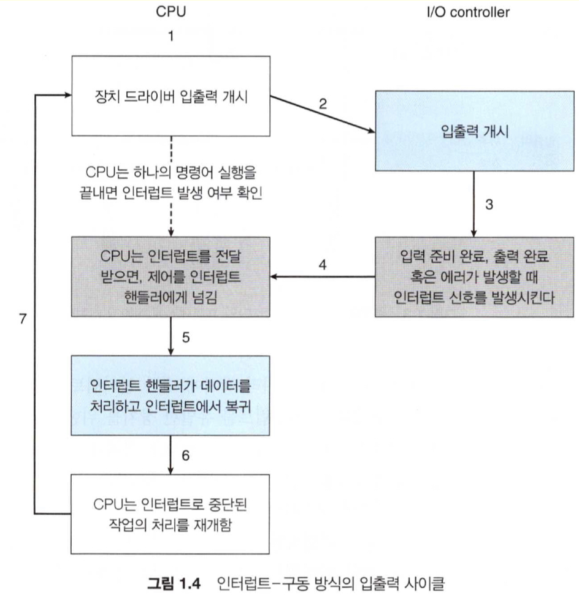

# 개요

운영체제(공룡책)을 읽고 컴퓨터 시스템의 구성, 구조에 대해 간략히 알아보고, 운영체제가 하는 일이 무엇인지 요약하겠습니다. 개인적으로 공부한 내용을 다시 보기 위해 작성한 글입니다.

# 컴퓨터 시스템 구성

범용 컴퓨터 시스템은 하나 이상의 CPU 구성요소와 공유 메모리 사이의 액세스를 제공하는 공통의 버스를 통해 연결된 여러 장치 컨트롤러로 구성된다.

## 인터럽트

하드웨어는 어느 순간이든 시스템 버스를 통해 CPU에 신호를 보내 인터럽트를 발생시킬 수 있다. 인터럽트는 다른 많은 목적으로도 사용되며 운영체제와 하드웨어의 상호 작용 방식의 핵심 부분이다.

이미지 출처: 운영체제(10th edition), (Abraham silberschatz, Peter baer galvin, Grag gagne), 10p

## 저장장치 구조

CPU는 메모리에서만 명령을 적재할 수 있으므로 실행하려면 프로그램을 먼저 메모리에 적재해야 한다. 

* 명령 레지스터
* 캐시
* 메인 메모리(random-access memory, RAM)
* 읽기 전용 메모리 및 펌웨어
* 보조 저장 장치(HDD)
* 3차 저장 장치(CD-ROM, Blu-ray 등)

## 입출력 구조

입출력 장치와 메모리 사이에 직접 메모리 엑세스(DMA) 를 사용.

-> 블럭 전송이 완료될 때 인터럽트 발생

# 운영체제의 작동

## 시작

1. 부트스트랩 프로그램이 운영체제 커널을 찾아 메모리에 적재
2. 일부 시스템 데몬들은 커널 외부에서 제공

## 인터럽트

* 하드웨어 인터럽트
* 트랩 -> 시스템콜

## 다중 태스킹

CPU 스케줄링: 여러 프로세스가 동시에 실행할 준비가 되면 시스템은 다음에 실행할 프로세스를 선택한다.

가상 메모리: 사용자에게 보이는 논리 메모리를 실제 물리 메모리로부터 분리시킨다. (가상 주소를 사용하기 때문에 프로그래밍 하기 쉽고, 실제 물리 메모리의 크기보다 가상 메모리 크기가 더 커도 된다)

## 이중 모드

* 사용자 모드
* 커널 모드

현재 모드를 나타내기 위해 모드 비트를 사용. 시스템에 악영향을 끼칠 수 있는 일부 명령을 특권 명령으로 지정하여 커널 모드에서만 실행되도록 한다.

## 시스템 콜

지정된 작업을 사용자 프로그램이 자신을 대신하여 운영체제가 수행되도록 요청.

## 타이머

제어권이 운영체제로 복귀하지 않을 경우가 없도록 방지하기 위해 타이머를 사용한다. (지정 시간 후 인터럽트 발생)

# 운영체제의 역할

* 자원 관리(프로세스, 메모리, 파일 시스템, 캐시, 입출력 시스템 등)
* 보안과 보호
* 가상화

# 출처

- 운영체제(10th edition), (Abraham silberschatz, Peter baer galvin, Grag gagne)