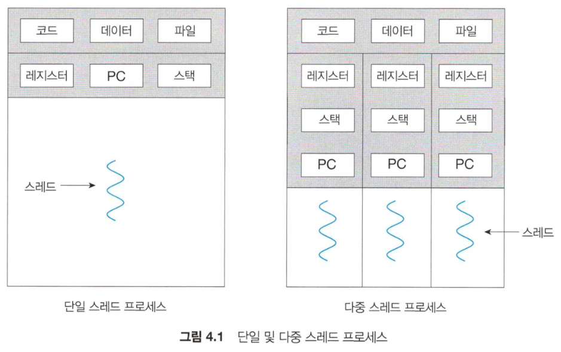
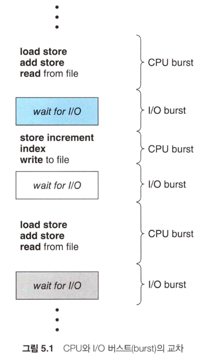
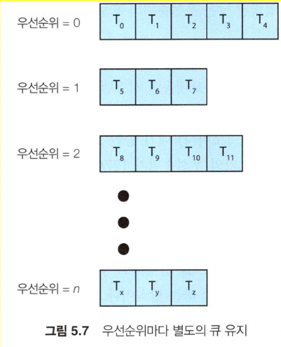

# 개요

운영체제(공룡책)을 읽고 개인적으로 공부한 내용을 정리하기 위해 작성한 글입니다.

프로세스 관리(3~5장) 중 너무 깊지 않고, 중요하다고 생각되는 내용 위주로 정리하였습니다.

# 프로세스(Process)

프로세스란 실행중인 프로그램을 말한다. 현대 컴퓨팅 시스템에서 작업의 단위이다.

## 프로그램 vs 프로세스

- 프로그램: 수동적인 존재. 디스크에 파일 형태로 저장된 명령어 리스트.
- 프로세스: 능동적인 존재. 다음에 실행할 명령어를 지정하는 프로그램 카운터와 관련 자원이 집합을 가짐.

## 프로세스의 메모리 구성

- 텍스트 섹션: 실행 코드
- 데이터 섹션: 전역 변수
- 힙 섹션: 프로그램 실행 중 동적으로 할당되는 메모리
- 스택 섹션: 함수를 호출할 때 임시 데이터 저장장소

## 프로세스의 상태

- new: 프로세스가 생성 중
- running: 명령어들이 실행 중
- waiting: 프로세스가 어떤 이벤트(입출력 완료 등)가 일어나기를 기다린다.
- ready: 프로세스가 실행될 준비가 된 상태
- terminated: 프로세스 종료

## 프로세스 제어 블록(PCB)

Process Control Block 이란, 운영체제에서 프로세스를 표현하기 위한 블록.

### 구성 요소

* 프로세스 상태
* 프로그램 카운터: 다음에 실행할 명령어 주소
* CPU 레지스터들 (인터럽트 발생 시 복구를 위해 레지스터 값들이 저장 됨)
* CPU-스케줄링 정보: 우선순위, 스케줄 큐에 대한 포인터, 다른 스케줄 매개변수 등
* accounting 정보: 사용 시간, 경과된 실시간, 시간 제한, 프로세스 번호 등
* 입출력 상태 정보: 이 프로세스에 할다오딘 입출력 장치들과 열린 파일의 목록 등

## 프로세스 스케줄링

### 스케줄링 큐

* 준비 큐: 생성되었거나, CPU에서 실행 준비가 되어 기다리는 프로세스들
* 대기 큐: I/O 완료와 같은 특정 이벤트가 발생하기를 기다리는 프로세스들

PCB 의 포인터들을 큐에 저장한다.

프로세스 종료 시점에 큐에서 제거되고 PCB 및 자원을 반환한다.

### CPU 스케줄링

CPU 스케줄러는 준비 큐에 있는 프로세스 중 하나의 프로세스에 CPU 코어를 할당한다.

* 스와핑: 메모리가 초과되어 가용공간을 확보해야할 때 메모리에서 디스크로 '스왑아웃', 이후 실행할 때 '스왑인'

### Context Switch

인터럽트가 발생하면 인터럽트 처리 후 현재 실행 중인 프로세스의 Context 를 복구할 수 있도록 저장해야한다.

Context 는 프로세스의 PCB 에 표현된다.

Context Switch 시간 동안 아무런 유용한 일을 못하기 때문에 순수한 오버헤드이다.

## 프로세스 간 통신

프로세스는 독립적인 메모리 공간을 할당 받는다. 따라서 정보를 교환하기 위해서는 통신이 필요하다. 이를 IPC(Interprocess Communication) 이라고 한다.

### 통신 방법

* 공유 메모리(shared memory): 통신할 프로세스들에 의해 공유되는 메모리 영역이 구축된다.
* 메시지 전달(message passing): 통신할 프로세스끼리 메시지를 교환하여 통신한다.

# 스레드(Thread)

스레드는 CPU 이용의 기본 단위이다. 스레드는 스레드 ID, 프로그램 카운터(PC), 레지스터 집합, 스택으로 구성된다.

같은 프로세스에 속한 스레드는 코드, 데이터 섹션, 그리고 열린 파일이나 신호와 같은 운영체제 자원들을 공유한다.

이미지 출처: 운영체제(10th edition), (Abraham silberschatz, Peter baer galvin, Grag gagne), 176p

### 왜 스레드가 나오게 되었는가?

프로세스 생성 작업은 매우 많은 시간을 소비하고 많은 자원을 필요로 하는 일이다. 하지만 새 프로세스가 해야할 일이 기존 프로세스가 하는 일과 동일하다면 이 많은 오버헤드를 감수할 일이 없다. 이러한 작업들에서 스레드가 보편적으로 사용되었다.

## Muti-thread 의 장점

### 1. 응답성(responsiveness)

대화형 프로그램 등에서 다중 스레드를 이용하면 사용자에 대한 응답성을 증가시킨다.

### 2. 자원 공유(resource sharing)

IPC(프로세스 간 통신)를 이용하지 않아도, 같은 프로세스 내에 속한 스레드는 자원과 메모리를 공유한다.

### 3. 경제성(economy)

프로세스 생성을 위해 메모리와 자원을 할당 받는 것보다 스레드를 생성하고 Context switch 를 이용하는 것이 더 경제적이다.

### 4. 규모 적응성(scalability)

다중 처리기 구조에서 다중 스레드의 이점이 더욱 증가된다.

## Thread pool

스레드를 무한정 만들면 언젠가는 CPU 시간, 메모리 공간 같은 시스템 자원이 고갈된다. 따라서 시스템에서 동시에 실행할 수 있는 최대 스레드 수를 제한해야한다. 이러한 문제점을 해결하기 위한 방법 중 하나가 스레드 풀이다.

### 동작

1. 일정한 수의 스레드를 미리 풀로 만들어 놓는다.
2. 평소에는 하는 일 없이 일감을 기다린다.
3. 새로운 일감이 주어지면 풀에 사용 가능한 스레드가 깨어나고 실행된다. (사용 가능한 스레드가 없다면 기다린다)
4. 스레드가 서비스를 완료하면 풀로 돌아가서 다시 일감을 기다린다.

# CPU 스케줄링

## CPU-I/O Burst Cycle

프로세스 실행은 CPU 실행과 I/O 대기의 사이클로 구성된다. 이를 CPU burst, I/O burst 라고 한다.

* I/O 바운드 프로세스: I/O 대기 시간 > CPU 점유 시간
* CPU 바운드 프로세스: CPU 점유 시간 > I/O 대기 시간

이미지 출처: 운영체제(10th edition), (Abraham silberschatz, Peter baer galvin, Grag gagne), 221p

## 선점 vs 비선점

* 선점: CPU 스케줄러가 실행되고 있는 프로세스의 자원을 빼앗아올 수 있다.
* 비선점: CPU 스케줄러가 실행 중인 프로세스가 종료하거나 대기 상태로 전환할 때까지 기다린다.

## 디스패처(Dispatcher)

CPU 스케줄러가 선택한 프로세스에게 CPU 코어의 제어권을 주는 모듈.

다음의 작업을 수행한다.

* 한 프로세스에서 다른 프로세스로 context switch
* 사용자 모드로 전환하는 일
* 프로그램을 다시 시작하기 위해 사용자 프로그램의 적절한 위치로 이동(jump) 하는 일

## 스케줄링 기준

CPU 스케줄링 알고리즘을 비교하기 위한 여러 기준. 어떤 기준을 고려하는지에 따라 최선의 알고리즘을 결정하는데 큰 차이가 발생한다.

* CPU 이용률
* 처리량: 단위 시간 당 완료된 프로세스의 개수
* 총 처리 시간: 프로세스의 제출 시간과 완료 시간의 간격
* 대기 시간: 프로세스가 준비 큐에서 대기하면서 보낸 시간의 합
* 응답 시간: 요구를 제출한 후 첫 번째 응답이 시작되는 데까지 걸리는 시간

CPU 이용률과 처리량을 최대화하고,

총 처리 시간, 대기 시간, 응답 시간을 최소화 하는 것이 바람직하다.

## 스케줄링 알고리즘

### FCFS (First-Come, First-Serve)

선입 선처리라는 말대로, CPU 를 먼저 요청하는 프로세스가 먼저 할당 받는다.

### SJF (Shortest-Job-First)

후술할 Priority Scheduling(우선 순위 스케줄링) 알고리즘 중 하나이다.

각 프로세스의 다음 CPU burst 길이를 보고 가장 짧은 프로세스를 할당한다. (주의: 프로세스의 전체 길이가 아니라, 다음 CPU busrt 시간이다)

하지만, 현실적으로 다음 CPU burst 길이를 알 수 있는 방법이 없기 때문에 이전 CPU burst 의 길이와 비슷할 것이라 예측하고 구현한다.

### RR (Round-Robin)

FCFS 와 비슷하지만 선점(preemptive) 스케줄링 알고리즘이다.

작은 단위 시간(time slice)을 정하고 해당 시간마다 돌아가면서 큐에 있는 프로세스들에게 CPU 제어권을 준다.

단위 시간을 극단적으로 크게 할 경우 FCFS 와 다를 것이 없어진다.

### Priority

프로세스마다 우선순위를 정해놓고, 가장 높은 우선순위를 가진 프로세스에게 CPU 제어권을 준다.

문제점: 우선순위가 매우 낮은 프로세스는 기아 상태(starvation)가 될 수 있다.

해결책: 노화. 오랫동안 시스템에서 대기하는 프로세스들의 우선순위를 시간이 지날 수록 증가시킨다.

### Multilevel Queue

이미지 출처: 운영체제(10th edition), (Abraham silberschatz, Peter baer galvin, Grag gagne), 236p

우선순위마다 큐를 하나씩 가지고 있는 방법이다.

**예시:** 포그라운드, 백그라운드 프로세스를 구분할 때 사용.

포그라운드와 백그라운드 프로세스가 일반적으로 응답 요구 시간이 다르기 때문에 별도의 큐로 관리한다.

각각 다른 스케줄링 알고리즘을 적용할 수도 있고, 포그라운드는 CPU time 의 80%, 백그라운드는 20% 로 나눠서 제어권을 주는 등의 방법도 사용할 수 있다.

### Multilevel Feedback Queue

Multilevel Queue 와 비슷하지만, 프로세스가 우선순위 큐들 사이를 이동할 수 있다는 차이가 있다.

예를 들어, 앞서 말한 노화를 적용해서 낮은 우선순위 큐에서 오래 기다린 프로세스를 높은 우선순위 큐로 이동할 수 있다.

# 출처

- 운영체제(10th edition), (Abraham silberschatz, Peter baer galvin, Grag gagne)