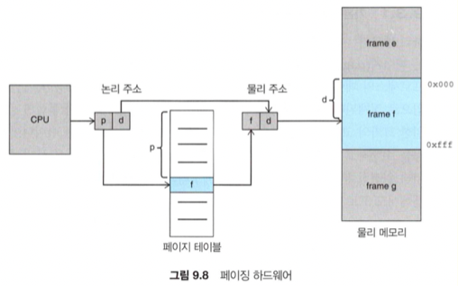

# 개요

운영체제(공룡책)을 읽고 개인적으로 공부한 내용을 정리하기 위해 작성한 글입니다.

메모리 관리 (chapter 9~10) 부분을 읽고 개인적으로 중요하다고 생각되는 부분을 위주로 정리하였습니다.

# 논리 주소 vs 물리 주소

* 논리 주소: CPU 가 생성하고 사용하는 가상 주소
* 물리 주소: 메모리가 취급하는 실제 메모리 주소

## MMU

**메모리 관리 장치(memory management unit)**: 가상 주소를 물리 주소로 바꾸어준다.

이미지 출처: 운영체제(10th edition), (Abraham silberschatz, Peter baer galvin, Grag gagne), 391p

# 동적 적재

적재 방법 중 프로세스가 실행되기 위해 프로세스 전체를 메모리에 올리는 방법이 있다. 이를 위해서는 실제 물리 메모리 크기가 프로세스 크기보다 작거나 같아야한다. 또한, 프로세스 중 거의 접근하지 않는 부분(예외 처리 등)도 메모리에 올라와 있어야 하는 등 메모리 공간 낭비를 유발한다.

따라서, 전체 프로세스에서 필요한 부분만을 메모리에 적재시키고 실행하는 것을 동적 적재라고 한다.

# 가변 파티션

메모리를 할당하는 가장 쉬운 방법.

처음에는 모든 메모리가 사용 가능한 상태에서, 실행될 프로세스를 위해 남은 공간 중 일부 블록(hole)을 할당해준다. 여러 프로세스가 실행, 종료를 반복하다보면 메모리 전체에서 사용 가능한 메모리들은 중간 중간 구멍이 뚫린 모습이 된다.

## 할당 방법

다음 실행될 프로세스를 위해 메모리 공간을 할당하는 방법들이다.

* **최초 적합**: 검색 지점으로부터 첫 번째 사용 가능한 가용 공간을 할당한다.
* **최적 적합**: 사용 가능한 모든 공간 중 가장 작은 것을 택하여 할당한다.
* **최악 적합**: 가장 큰 가용 공간을 택한다.

# 단편화 문제

## 외부 단편화

프로세스들이 적재되고, 제거되는 일이 반복되다 보면, 어떤 가용 공간은 너무 작아서 할당할 수 없는 조각이 되어버린다.

이러한 조각들을 합치면 프로세스를 할당하기 충분한 공간이 되지만, 나뉘어 분산되어 있을 때는 할당하지 못한다.

## 내부 단편화

일반적으로 메모리를 먼저 작은 단위로 분할하고, 프로세스가 요청할 경우 이 분할된 크기의 정수배로 해준다.

즉, 실제로 프로세스가 요구하는 공간보다 약간 더 크게 할당해줄 수 있다. 이 경우 사용하지 않는 남는 부분이 내부 단편화에 해당된다.

# 페이징

물리 메모리는 프레임(frame), 논리 메모리는 페이지(page) 라 불리는 같은 크기의 블록으로 나눈다.

CPU 에서 사용하는 페이지를 실제 물리 메모리의 프레임과 매핑시켜서 사용한다.

## 페이지 테이블

페이지와 프레임을 매핑시키기 위해 존재한다.

CPU 에서 나오는 모든 주소는 페이지 번호와 페이지 오프셋 두 개 부분으로 나누어진다. 이 중 페이지 번호를 통해 실제 프레임의 위치를 찾는다.

이미지 출처: 운영체제(10th edition), (Abraham silberschatz, Peter baer galvin, Grag gagne), 398p

## 프레임 테이블

프레임 테이블은 각 프레임이 비어 있는지, 할당되었는지, 할당 되었다면 어느 프로세스의 어느 페이지에 할당되었는지를 나타낸다.

## PTBR

프로세스가 사용할 페이지 테이블을 메인 메모리에 저장한다.

프로세스별로 이 페이지 테이블 주소를 가리키는 레지스터인 PTBR(page-table base register)를 둔다.

## TLB

페이지 테이블이 메인 메모리에 적재되어 있을 경우를 고려하였을 때, 실제 주소를 얻어오기 위해서는 다음 2번의 메모리 접근이 필요하다.

1. PTBR 을 이용하여 페이지 테이블에 접근하여 실제 주소를 생성한다.
2. 실제 주소에 접근한다.

이 문제를 해결하기 위해 TLB(tanslation look-aside buffers) 라는 소형 하드웨어 캐시를 사용한다.

페이지 테이블 중 일부를 캐시해놓고 빠르게 실제 주소를 얻어와 한 번만 메모리 접근을 하도록 한다.

# 가상 메모리

프로세스 전체가 메모리 내에 올라오지 않더라도 실행이 가능하도록 하는 기법.

실제의 물리 메모리 개념과 개발자의 논리 메모리 개념을 분리한 것이다.

## 장점

* 프로그램은 물리 메모리 크기에 의해 제약받지 않아도 된다.
* 각 프로그램이 더 작은 메모리를 차지하므로 더 많은 프로그램을 동시에 실행할 수 있다.
* 프로그램을 메모리에 올리고 스왑하는데 필요한 I/O 횟수가 줄어든다.

# 요구 페이징

프로그램 실행 중 필요할 때만 해당 페이지가 메모리에 적재된다.

## valid-invalid bit

이 비트를 이용하여 메모리에 있는지 여부를 파악한다.

* 유효(valid): 해당 페이지가 메모리에 있다.
* 무효(invalid): 해당 페이지가 유효하지 않거나, 유효하지만 보조저장장치에 존재한다.

메모리에 올라와 있지 않은 페이지에 접근하려고 할 때 **페이지 폴트** 트랩이 발생한다.

이미지 출처: 운영체제(10th edition), (Abraham silberschatz, Peter baer galvin, Grag gagne), 433p

# 페이지 교체

페이지 폴트가 발생하였으나, 물리 메모리에 가용 프레임이 없을 경우, 현재 사용되고 있지 않는 프레임을 찾아 비워버린다. (이 프레임과 연결 된 페이지 테이블도 invalid 로 변화시킨다) 이제 이 새로운 프레임을 페이지 폴트를 발생시킨 프로세스가 사용할 수 있게 한다.

## 페이지 교체 알고리즘

페이지 폴트가 발생했을 때 일반적으로 페이지 폴트율이 가장 낮은 것을 선정한다.

### FIFO

First-In, First-Out. 메모리에 올라온지 가장 오래된 페이지를 찾아 교체한다.

### 최적 페이지 교체

앞으로 가장 오랫동안 사용되지 않을 페이지를 찾아 교체한다.

할당된 프레임 수가 고정된 경우 가장 낮은 페이지 폴트율을 보장한다. 하지만 프로세스가 앞으로 메모리를 어떻게 참조할지 미리 알지 못하기 때문에 실제 구현이 어렵다.

### LRU 페이지 교체

LRU(lest-recently-used) 알고리즘은 가장 오랜 기간 동안 사용되지 않은 페이지를 교체한다.

구현을 위해 페이지마다 마지막으로 사용된 시간을 알고 있어야한다.

### LFU 교체

LFU (least frequently used) 알고리즘은 참조 횟수가 가장 적은 페이지를 교체한다.

# 출처

- 운영체제(10th edition), (Abraham silberschatz, Peter baer galvin, Grag gagne)