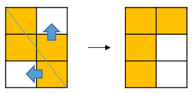
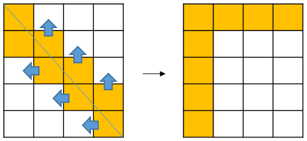

# 문제 링크

https://programmers.co.kr/learn/courses/30/lessons/62048


# 풀이 핵심

1. 가로, 세로의 GCD 만큼 못쓰는 사각형 덩어리가 생긴다.
2. 한 덩어리 내에서 못쓰는 사각형 개수 구하기


1은 쉽게 생각할 수 있었으나, 2를 해결하기 위해 고민을 많이 했었습니다.

처음에는 좌표평면에서 y절편과 x절편이 각각 mw, mh인 그래프를 그리고 y(1)...y(mh-1)의 값을 이용하여 못쓰는 사각형을 구하려 하였습니다.





이렇게 왼쪽과 위쪽으로 밀어보면 못 쓰는 사각형의 개수를 쉽게 구할 수 있습니다.


# 풀이 

```java
public long solution(int w, int h) {
    int gcd;
    if (w > h) {
        gcd = getGCD(w, h);
    } else {
        gcd = getGCD(h, w);
    }
    int mw = w / gcd;
    int mh = h / gcd;

    long ret = (long) w * h - (long) gcd * (mw + mh - 1);
    return ret;
}

private int getGCD(int B, int S) {
    int r = B % S;
    if (r == 0) {
        return S;
    }
    return getGCD(S, r);
}
```