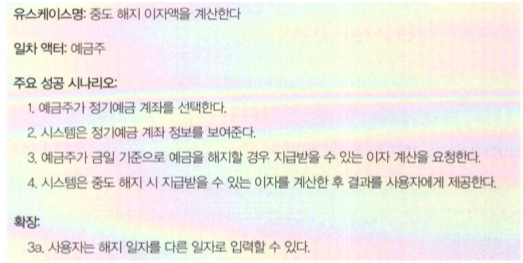

# 개요

인프런에서 김영한님의 스프링 기초 강의 수강 중, 추천해주셔서 읽게 된 책입니다.

너무 좋은 내용들로 구성되어 있어서 객체지향개발을 하시는 분들이라면, 꼭 한번 읽어보셨으면 좋겠습니다.

1장 ~ 7장까지 인상적이었던 내용을 간략하게 작성하겠습니다.

# 1장: 협력하는 객체들의 공동체

> 객체지향의 목표는 실세계를 모방하는 것이 아니다. 오히려 새로운 세계를 창조하는 것이다.

-> 소프트웨어 세계와 실세계의 객체지향은 비슷한 것 같지만, 먼 거리가 있다.

## 역할, 책임, 협력

**역할**: 협력하는 과정 속에서 부여받는 것. 여러 사람이 동일한 역할을 수행할 수 있다. (즉, 대체 가능성이 있다), 관련성 높은 책임들의 집합이다.

**책임**: 책임을 수행하는 방법은 자율적으로 선택할 수 있다. (동일한 요청에 대해 서로 다른 방식으로 응답할 수 있는 능력을 다형성이라고 한다.)

**협력**: 객체들은 역할과 책임을 수행하며 협력한다.

# 2장: 이상한 나라의 객체

## 객체

> 객체를 상태(state), 행동(behavior), 식별자(identity)를 지닌 실체로 보는 것이 가장 효과적이다.

## 상태

> 상태를 이용하면 과거의 모든 행동 이력을 설명하지 않고도 행동의 결과를 쉽게 예측하고 설명할 수 있다.

> 모든 객체의 상태는 단순한 값과 객체의 조합으로 표현할 수 있다. 이때 객체의 상태를 구성하는 모든 특징을 통틀어 객체의 **프로퍼티(property)**라고 한다.

### 링크

객체와 객체 사이의 의미있는 연결. 링크를 통해서만 메시지를 주고받을 수 있다.

## 행동

> 행동이란 외부의 요청 또는 수신된 메시지에 응답하기 위해 동작하고 반응하는 활동이다. 행동의 결과로 객체는 자신의 상태를 변경하고나 다른 객체에게 메시지를 전달할 수 있다. 객체는 행동을 통해 다른 객체와의 협력에 참여하므로 행동은 외부에 가시적이어야 한다.

## 식별자

> 객체가 식별 가능하다는 것은 객체를 서로 구별할 수 있는 특정한 프로퍼티가 객체 안에 존재한다는 것을 의미한다. 이 프로퍼티를 식별자라고 한다. 모든 객체는 식별자를 가지며 식별자를 이용해 객체를 구별할 수 있다.

# 3장: 타입과 추상화

## 추상화

추상화의 좋은 예시: 지하철 노선도

현실적이고 정확한 정보를 담기 위해서는 실제 지도 위에 구불구불한 지하철 노선도를 그려야 합니다. 하지만, 지하철을 이용하는 승객의 입장에서 이러한 정보가 모두 필요할까요?

승객은 도착역에 가기 위해 몇 정거장이 남았는지, 어디서 갈아타야하는지 등의 정보만 알면 지하철을 이용할 수 있습니다. 실제 역과 역 사이의 거리가 얼마인지, 직선으로 길이 나있는지 곡선으로 길이 나있는지 등은 승객에게 필요한 정보가 아닙니다. 지금 우리가 사용하는 지하철 노선도는 실제 지도와 많이 다릅니다. 하지만 승객에게는 실제 지도에서 필요없는 정보를 제거한 지하철 노선도가 더 유용합니다.

이처럼 필요 없는 정보를 제거하고 필요한 정보만을 취해 더 압축적으로 표현하는 것을 추상화라고 합니다.

## 인스턴스

> 객체에 어떤 개념을 적용하는 것이 가능해서 개념 그룹의 일원이 될 때 객체를 그 개념의 인스턴스(instance)라고 한다.

e.g. 이상한 나라의 앨리스에서

개념 그룹 : 트럼프

인스턴스 : 하트 여왕, 클로버 병사

## 타입

> 타입은 개념과 동일하다. 따라서 타입이란 우리가 인식하고 있는 다양한 사물이나 객체에 적용할 수 있는 아이디어나 관념을 의미한다. 어떤 객체에 타입을 적용할 수 있을 때 그 객체를 타입의 인스턴스라고 한다. 타입의 인스턴스는 타입을 구성하는 외연인 객체 집합의 일원이 된다.

> 어떤 객체를 다른 객체와 동일한 타입으로 분류하는 기준은 무엇인가? 그 객체가 타입에 속한 다른 객체와 동일한 행동을 하기만 하면 된다. 그 객체가 어떤 데이터를 가지고 있는지는 우리의 관심사가 아니다.

# 4장: 역할, 책임, 협력

> 객체의 모양을 빚는 것은 객체가 참여하는 협력이다. 어떤 협력에 참여하는지가 객체에 필요한 행동을 결정하고, 필요한 행동이 객체의 상태를 결정한다. 개별적인 객체의 행동이나 상태가 아니라 객체들 간의 협력에 집중하라.

## 책임

> 객체지향의 세계에서는 어떤 객체가 어떤 요청에 대해 대답해 줄 수 있거나, 적절한 행동을 할 의무가 있는 경우 해당 객체가 책임을 가진다고 말한다.

### 책임의 분류

#### 하는 것

* 객체를 생성하거나 계산을 하는 등의 스스로 하는 것
* 다른 객체의 행동을 시작시키는 것
* 다른 객체의 활동을 제어하고 조절하는 것

#### 아는 것

* 개인적인 정보에 관해 아는 것
* 관련된 객체에 관해 아는 것
* 자신이 유도하거나 계산할 수 있는 것에 관해 아는 것

## 역할

> 역할은 협력 내에서 다른 객체로 대체할 수 있음을 나타내는 일종의 표식이다.

> 역할을 대체하기 위해서는 각 역할이 수신할 수 있는 메시지를 동일한 방식으로 이해해야 한다.

> 역할은 객체지향 설계의 단순성(simplicity), 유연성(flexibility), 재사용성(reusability)을 뒷받침하는 핵심 개념이다.

## 협력

**흔한 오류**

* 시스템에 필요한 데이터를 저장하기 위해 객체가 존재한다는 선입견
* 객체지향이 클래스와 클래스 간의 관계를 표현하는 시스템의 정적인 측면에 중점을 둔다는 선입견

### 핵심

> **객체 지향의 핵심은 클래스를 어떻게 구현할 것인가가 아니라 객체가 협력 안에서 어떤 책임과 역할을 수행할 것인지를 결정하는 것이다.**

## 객체지향 설계 기법

* 책임-주도 설계 (Responsibility-Driven Design)
* 디자인 패턴(Design Pattern)
* 테스트-주도 개발(Test-Driven Development)

# 5장: 책임과 메시지

## 자율적인 책임

> 객체지향 공동체를 구성하는 기본 단위는 '자율적'인 객체다.

너무 구체적이지도, 추상적이지도 않게 책임을 설계할 것.

너무 구체적이면 자율성을 훼손하고, 너무 추상적이면 협력의 의도를 명확하게 표현하지 못한다.

## 메시지

> 협력 안에서 객체는 다른 객체로부터 요청이 전송됐을 경우에만 자신에게 주어진 책임을 수행한다.
>
> 객체가 다른 객체에게 주어진 책임을 수행하도록 요청을 보내는 것을 메시지 전송(message-send)이라고 한다.

메시지를 전송할 때 추가적인 정보가 필요한 경우 메시지의 인자(argument)를 통해 추가 정보를 제공할 수 있다.

## 메서드

메시지는 '어떻게' 수행될 것인지는 명시하지 않는다. '무엇'이 실행되기를 바라는지만 명시.

메시지를 수신한 객체는 자율적으로 내부에서 메서드를 선택한다.

## 다형성

> 다형성이란 서로 다른 유형의 객체가 동일한 메시지에 대해 서로 다르게 반응하는 것을 의미한다. 좀 더 구체적으로 말해 서로 다른 타입에 속하는 객체들이 동일한 메시지를 수신할경우 서로 다른 메서드를 이용해 메시지를 처리할 수 있는 메커니즘을 가리킨다.

## 메시지를 따라라

> 객체 자체에 초점을 맞출 경우 가장 흔히 범하게 되는 실수는 협력이라는 문맥을 배제한 채 객체 내부의 데이터 구조를 먼저 생각한 후 데이터 조작에 필요한 오퍼레이션을 나중에 고려하는 것이다.

### 책임-주도 설계

1. 객체가 책임을 완수하기 위해 다른 객체의 도움이 필요
2. 도움을 청하기 위해 어떤 메시지가 필요한지 결정
3. 메시지를 수신하기 적합한 객체를 선택
4. 수신자는 송신자가 메시지를 보내면서 기대한 대로 메시지를 처리할 책임이 있음

> **결과적으로 메시지가 수신자의 책임을 결정한다**

### What/Who 사이클

> 먼저 '어떤 행위(what)'를 수행할 것인지를 결정한 후 '누가(who)' 그 행위를 수행할 겻인지를 결정

### 묻지 말고 시켜라

> 송신자는 수신자가 어떤 객체인지 모르지만 자신이 전송한 메시지를 잘 처리할 것이라는 것을 믿고 메시지를 전송할 수밖에 없다.

> '어떻게'에서 '무엇'으로 전환하는 것은 객체 인터페이스의 크기를 급격하게 감소시킨다. 인터페이스의 크기가 작다는 것은 외부에서 해당 객체에게 의존해야하는 부분이 적어진다는 것을 의미한다.

## 자율적인 책임의 장점

1. 협력을 단순하게 만든다.
2. 외부와 내부를 명확하게 분리한다.
3. 내부적인 방법을 변경하더라도 외부에 영향을 미치지 않는다. (결합도가 낮아진다)
4. 협력의 대상을 다양하게 선택할 수 있는 유연성을 제공한다. (설계가 유연해지고 재사용성이 높아진다)
5. 객체의 역할을 이해하기 쉬워진다.

# 6장: 객체 지도

## 기능 설계 vs 구조 설계

기능 측면 설계: 제품이 사용자를 위해 무엇을 할 수 있는지

구조 측면 설계: 제품의 형태가 어떠해야 하는지

> 훌륭한 기능이 훌륭한 소프트웨어를 만드는 충분조건이라고 한다면 훌륭한 구조는 훌륭한 소프트웨어를 만들기 위한 필요조건이다.

설계가 중요한 이유: 변경에 대한 필요성. (변경은 필연적이다)

> 미래에 대비하는 가장 좋은 방법은 변경을 예측하는 것이 아니라 변경을 수용할 수 있는 선택의 여지를 설계에 마련해 놓는 것이다.
>
> 좋은 설계는 나중에라도 변경할 수 있는 여지를 남겨 놓는 설계다.

## 구조

도메인 모델

## 기능

유스케이스

# 7장: 함께 모으기

# 출처

* 📙객체지향의 사실과 오해, 조영호