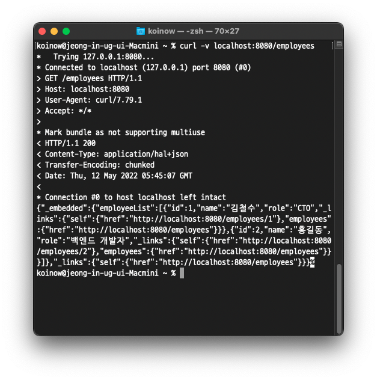

# 개요

이전 포스트에서 웹 컨트롤러까지 추가하여 완성된 웹 어플리케이션을 만들어보았습니다.

하지만 튜토리얼에서는, 지금까지 만든 것이 RESTful 한가? RESTful 한게 무엇인가? 등의 질문을 던지고 있습니다.

본 포스팅에서 해당 내용들을 자세하게 설명하지는 않겠습니다. 더 알고싶으신 경우 [https://spring.io/guides/tutorials/rest/](https://spring.io/guides/tutorials/rest/) 튜토리얼 페이지에서 확인해보시면 좋을 것 같습니다!


# RESTful 예시

튜토리얼에서는, RESTful 서비스의 중요한 재료 중 하나가 관련된 '링크'를 추가하는 것이라고 말합니다.

```Json
{
  "id": 1,
  "name": "Bilbo Baggins",
  "role": "burglar",
  "_links": {
    "self": {
      "href": "http://localhost:8080/employees/1"
    },
    "employees": {
      "href": "http://localhost:8080/employees"
    }
  }
}
```

위와 같이 한 명의 Employee 를 조회할 때, 조회한 정보는 물론 관련된 링크를 응답으로 포함시키는 것입니다.


# 단일 조회 메서드 수정

우선 linkTo 와 methodOn 메서드를 사용하기 위해 다음 경로를 static import 해야합니다.

```java
import static org.springframework.hateoas.server.mvc.WebMvcLinkBuilder.*;
```


응답을 위와 같이 구현하기 위해서는 EmployeeController 를 다음과 같이 수정해야합니다.

```java
@GetMapping("/employees/{id}")
EntityModel<Employee> one(@PathVariable Long id) {

  Employee employee = repository.findById(id) //
      .orElseThrow(() -> new EmployeeNotFoundException(id));

  return EntityModel.of(employee, //
      linkTo(methodOn(EmployeeController.class).one(id)).withSelfRel(),
      linkTo(methodOn(EmployeeController.class).all()).withRel("employees"));
}
```

EntityModel\<T> 는 Spring HATEOAS 에서 제공하는 데이터와 링크들을 포함하는 객체입니다.

Employee 객체 이외에도, linkTo 메서드를 이용하여 자신의 참조 링크와 전체 조회의 링크를 EntityModel 에 추가해주고 있습니다.

# 전체 조회 메서드 수정

all 메서드를 다음과 같이 수정합니다.

```java
@GetMapping("/employees")
CollectionModel<EntityModel<Employee>> all() {

  List<EntityModel<Employee>> employees = repository.findAll().stream()
      .map(employee -> EntityModel.of(employee,
          linkTo(methodOn(EmployeeController.class).one(employee.getId())).withSelfRel(),
          linkTo(methodOn(EmployeeController.class).all()).withRel("employees")))
      .collect(Collectors.toList());

  return CollectionModel.of(employees, linkTo(methodOn(EmployeeController.class).all()).withSelfRel());
}
```


스트림과 람다를 이용하여 findAll() 에서 가져온 Employee 객체들을 List\<EntityModel\<Employee>> 로 매핑시키고 있습니다.

람다식 안에서는 위에서 보았던 one 메서드와 비슷하게 Employee 객체와 자신의 링크, 전체 조회의 링크를 추가해주고 있습니다.


# 결과 확인

이전 포스트에서 실습해보았던 전체 조회를 터미널로 실행해봅니다.

```bash
$ curl -v localhost:8080/employees
```




결과를 조금 더 보기 좋게 정리하면 다음과 같습니다.

```json
{
  "_embedded": {
    "employeeList": [
      {
        "id": 1,
        "name": "김철수",
        "role": "CTO",
        "_links": {
          "self": {
            "href": "http://localhost:8080/employees/1"
          },
          "employees": {
            "href": "http://localhost:8080/employees"
          }
        }
      },
      {
        "id": 2,
        "name": "홍길동",
        "role": "백엔드 개발자",
        "_links": {
          "self": {
            "href": "http://localhost:8080/employees/2"
          },
          "employees": {
            "href": "http://localhost:8080/employees"
          }
        }
      }
    ]
  },
  "_links": {
    "self": {
      "href": "http://localhost:8080/employees"
    }
  }
}
```

조회한 결과, 링크가 잘 추가되어 있는 것을 확인할 수 있습니다.


# 출처

* [Building REST services with Spring](https://spring.io/guides/tutorials/rest/)