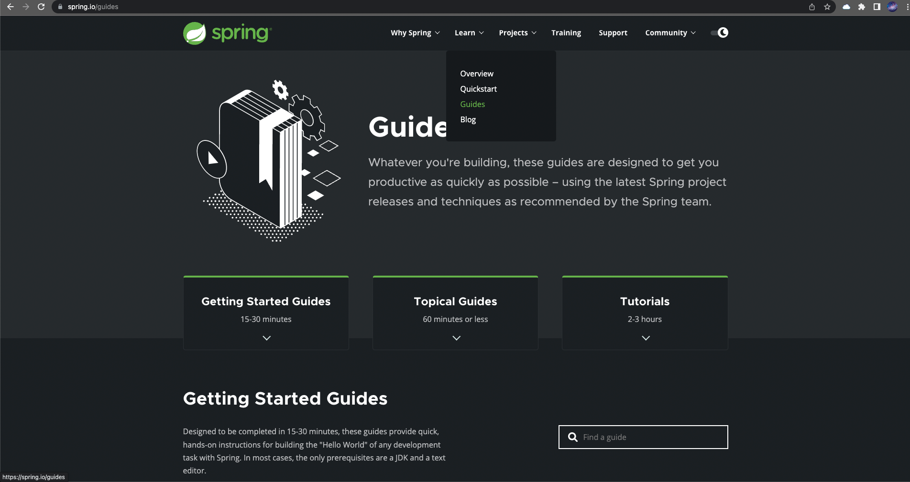
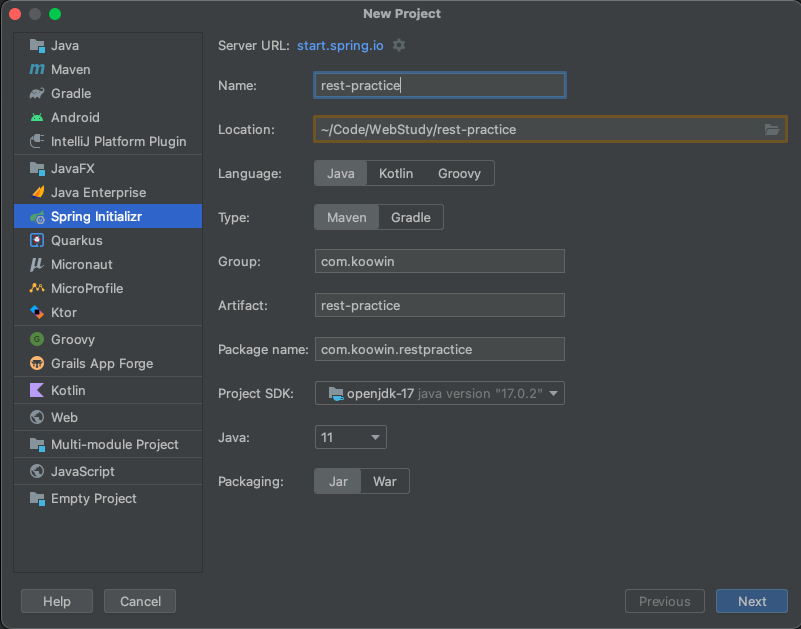
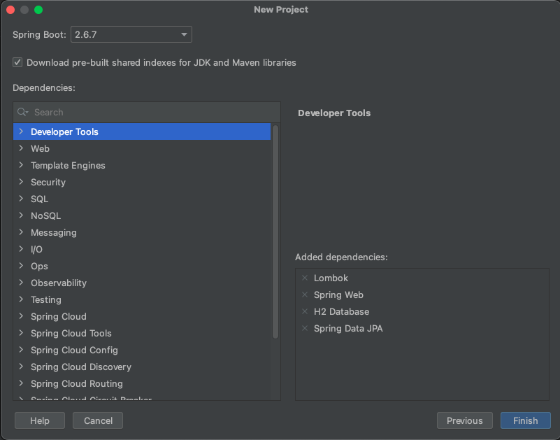

# 개요

spring.io 공식 웹에 접속해보면, 다음과 같이 Learn 탭이 있습니다.



이 페이지에서 Tutorials -> [Building REST services with Spring](https://spring.io/guides/tutorials/rest/) 에 접속하여 튜토리얼을 따라 만들어보면서 공부해보았습니다.


# 시작하기

프로젝트를 Spring Initializr 로 생성하였습니다.

이름, 그룹명 등은 원하는대로 설정하시면 됩니다.

저는 Maven 대신 Gradle 을 선택하였습니다.



Dependency 설정 탭입니다.

튜토리얼에서 요구하는 Spring Web, H2 Database, Spring Data JPA 는 필수로 선택하시면 되고, 저는 추가적으로 Lombok 도 선택하여 진행했습니다.




# 도메인

이 튜토리얼에서는 Employee 라는 클래스를 도메인으로 사용합니다.

```java
package com.koowin.restpractice.payroll;

import lombok.Getter;
import lombok.Setter;
import lombok.ToString;

import javax.persistence.Entity;
import javax.persistence.GeneratedValue;
import javax.persistence.Id;
import java.util.Objects;

@Getter
@Setter
@ToString
@Entity         //JPA 기반 저장소에 저장하겠다는 선언
public class Employee {
    private @Id
    @GeneratedValue
    Long id;        //Primary Key
    private String name;
    private String role;

    public Employee() {
    }

    public Employee(String name, String role) {
        this.name = name;
        this.role = role;
    }

    @Override
    public boolean equals(Object o) {
        if (this == o) return true;
        if (o == null || getClass() != o.getClass()) return false;
        Employee employee = (Employee) o;
        return Objects.equals(id, employee.id) && Objects.equals(name, employee.name) && Objects.equals(role, employee.role);
    }

    @Override
    public int hashCode() {
        return Objects.hash(id, name, role);
    }
}
```


Lombok 라이브러리의 @Getter, @Setter, @ToString 에너테이션을 사용하여 좀 더 간단하게 만들었습니다.


# JPA Repository

위에서 만든 Employee 클래스를 저장소에 저장하기 위해 JPA Repository를 생성합니다.

```java
package com.koowin.restpractice.payroll;

import org.springframework.data.jpa.repository.JpaRepository;

interface EmployeeRepository extends JpaRepository<Employee, Long> {
}
```


JpaRepository 인터페이스를 상속받아 아주 간단하게 만들 수 있습니다.

JpaRepository 인터페이스를 타고 타고 들어가보니, CrudRepository 라는 인터페이스를 발견하였고, 여기에 정의된 메서드들이 직관적으로 이해하기 쉬웠습니다.

CrudRepository 의 메서드만 간략히 나열하자면 다음과 같습니다.

```java
	<S extends T> S save(S entity);
	<S extends T> Iterable<S> saveAll(Iterable<S> entities);
	Optional<T> findById(ID id);
	boolean existsById(ID id);
	Iterable<T> findAll();
	Iterable<T> findAllById(Iterable<ID> ids);
	long count();
	void deleteById(ID id);
	void delete(T entity);
	void deleteAllById(Iterable<? extends ID> ids);
	void deleteAll(Iterable<? extends T> entities);
	void deleteAll();
```

기본적인 저장, 조회, 삭제가 정의되어 있습니다. 수정은 저장과 동일하게 save 메서드를 이용하여 하는 것 같습니다.


# 정리

단 2개의 클래스로 아주 간단한 어플리케이션이 완성되었습니다.

Employee 를 도메인으로 사용하고, Jpa 를 이용해 추가, 조회, 수정, 삭제 기능을 수행할 수 있습니다.

# 출처

* [Building REST services with Spring](https://spring.io/guides/tutorials/rest/)