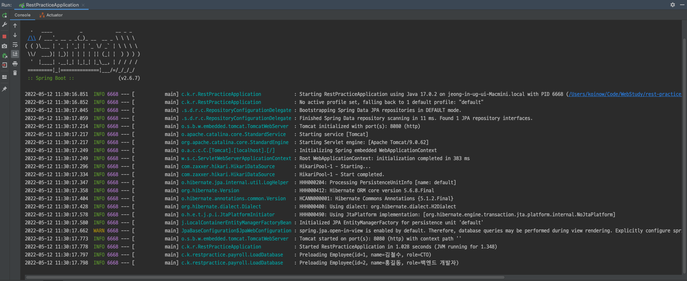
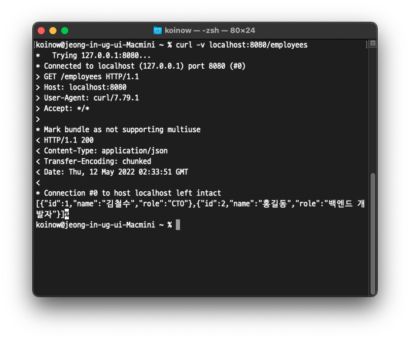
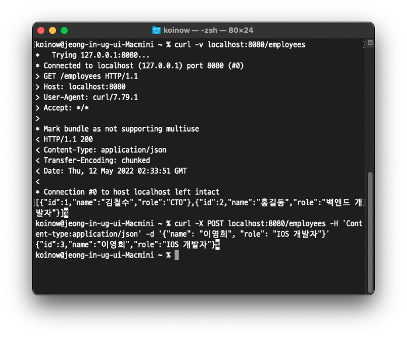
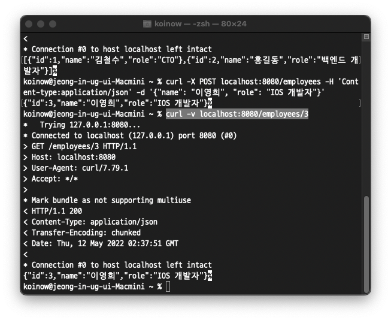

# 개요

이전 포스트에서 JpaRepository 를 상속받아 EmployeeRepository 까지 만들어보았습니다.

이번에는 초기 데이터를 넣어보고, HTTP 메시지를 받아 추가, 조회, 수정, 삭제 동작을 수행하는 Controller 를 만들어보겠습니다.

# LoadDatabase

현재 EmployeeRepository 는 메모리 위에서 간단하게 동작합니다. 따라서 스프링을 실행할 때 아무런 Employee 데이터도 들어있지 않습니다.

다음과 같이 초기화 시 데이터를 추가하는 로직을 구현합니다.

```java
package com.koowin.restpractice.payroll;

import org.slf4j.Logger;
import org.slf4j.LoggerFactory;
import org.springframework.boot.CommandLineRunner;
import org.springframework.context.annotation.Bean;
import org.springframework.context.annotation.Configuration;

@Configuration
public class LoadDatabase {
    private static final Logger log = LoggerFactory.getLogger(LoadDatabase.class);

    // Spring Boot 는 시작 시 모든 CommandLineRunner 를 시작함
    @Bean
    CommandLineRunner initDatabase(EmployeeRepository repository) {
        return args -> {
            log.info("Preloading " + repository.save(new Employee("김철수", "CTO")));
            log.info("Preloading " + repository.save(new Employee("홍길동", "백엔드 개발자")));
        };
    }
}
```

# Controller

여기서는 웹 메시지에 따라 동작하는 컨트롤러를 추가합니다.

```java
package com.koowin.restpractice.payroll;

import lombok.RequiredArgsConstructor;
import org.springframework.web.bind.annotation.*;

import java.util.List;

@RequiredArgsConstructor
@RestController
public class EmployeeController {
    private final EmployeeRepository repository;

    // GET, localhost:8080/employees -> 모든 Employees 조회
    @GetMapping("/employees")
    List<Employee> all() {
        return repository.findAll();
    }

    // POST, localhost:8080/employees -> Employee 한 명 추가
    @PostMapping("/employees")
    Employee newEmployee(@RequestBody Employee newEmployee) {
        return repository.save(newEmployee);
    }

    // GET, localhost:8080/employees/{id} -> {id} Employee 조회
    // e.g. GET: localhost:8080/employees/3 -> 3번 Employee 조회
    @GetMapping("/employees/{id}")
    Employee one(@PathVariable Long id) {
        return repository.findById(id)
                .orElseThrow(() -> new EmployeeNotFoundException(id));
    }

    // PUT, localhost:8080/employees/{id} -> {id} Employee 추가, 수정
    @PutMapping("/employees/{id}")
    Employee replaceEmployee(@RequestBody Employee newEmployee, @PathVariable Long id) {
        return repository.findById(id)
                .map(employee -> {
                    employee.setName(newEmployee.getName());
                    employee.setRole(newEmployee.getRole());
                    return repository.save(employee);
                })
                .orElseGet(() -> {
                    newEmployee.setId(id);
                    return repository.save(newEmployee);
                });
    }

    // DELETE, localhost:8080/employees/{id} -> {id} Employee 삭제
    @DeleteMapping("/employees/{id}")
    void deleteEmployee(@PathVariable Long id) {
        repository.deleteById(id);
    }
}
```


# 실행 해보기

## 서버 실행

```java
package com.koowin.restpractice;

import org.springframework.boot.SpringApplication;
import org.springframework.boot.autoconfigure.SpringBootApplication;

@SpringBootApplication
public class RestPracticeApplication {
    public static void main(String[] args) {
        SpringApplication.run(RestPracticeApplication.class, args);
    }
}
```

처음 프로젝트를 시작할 때 있던 ~~Aplication 클래스의 main 메서드를 실행시킵니다.



다음과 같이 서버가 실행됩니다.


## HTTP request 보내기

Spring 튜토리얼에서는 curl 을 사용하여 HTTP 메시지를 전송합니다.

튜토리얼을 따라 터미널을 실행하고 다음 명령어를 입력해보겠습니다.

```bash
$ curl -v localhost:8080/employees
```



초기화 시 넣어주었던 김철수와 홍길동이 저장소에 들어있는 것을 확인할 수 있습니다.


POST 를 사용해 새로운 사용자를 추가해보겠습니다.

```bash
$ curl -X POST localhost:8080/employees -H 'Content-type:application/json' -d '{"name": "이영희", "role": "IOS 개발자"}'
```



잘 추가 되었는지 3번 아이디로 조회해보겠습니다.

```bash
$ curl -v localhost:8080/employees/3
```



3번 아이디로 잘 조회가 됩니다!

추가 및 수정과 삭제 명령어는 다음과 같이 입력하시면 됩니다.

3번 사용자 추가 혹은 수정

```bash
$ curl -X PUT localhost:8080/employees/3 -H 'Content-type:application/json' -d '{"name": "박영수", "role": "안드로이드 개발자"}'
```

3번 사용자 삭제

```bash
$ curl -X DELETE localhost:8080/employees/3
```


# 출처

* [Building REST services with Spring](https://spring.io/guides/tutorials/rest/)