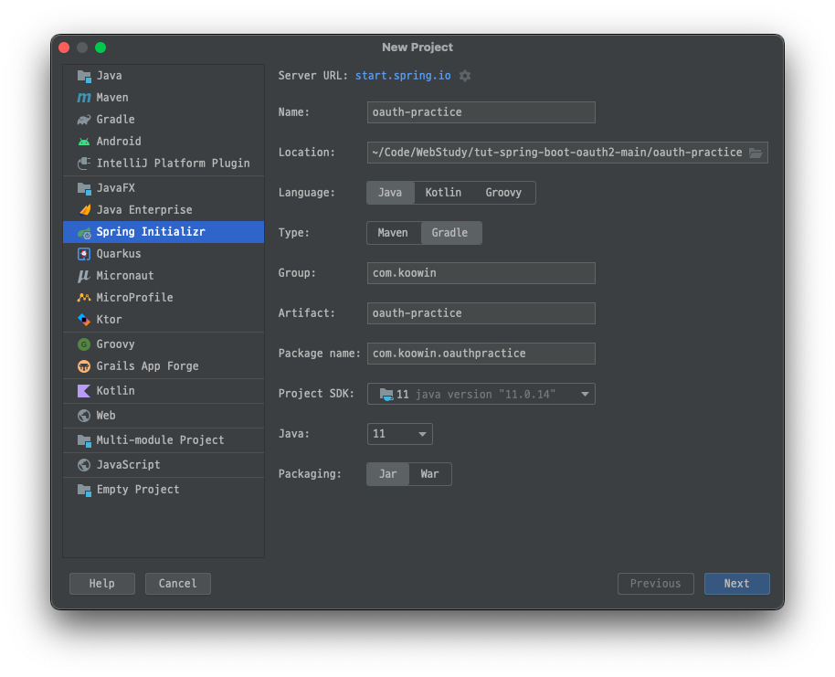
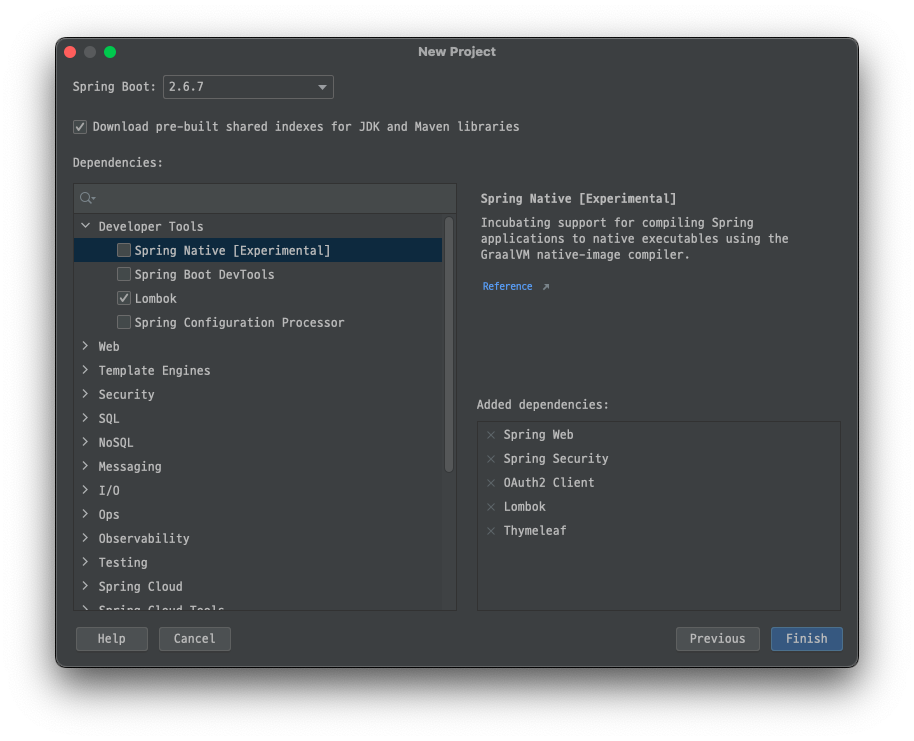
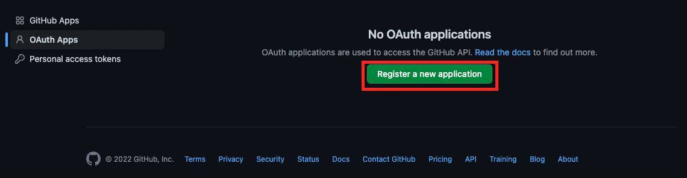
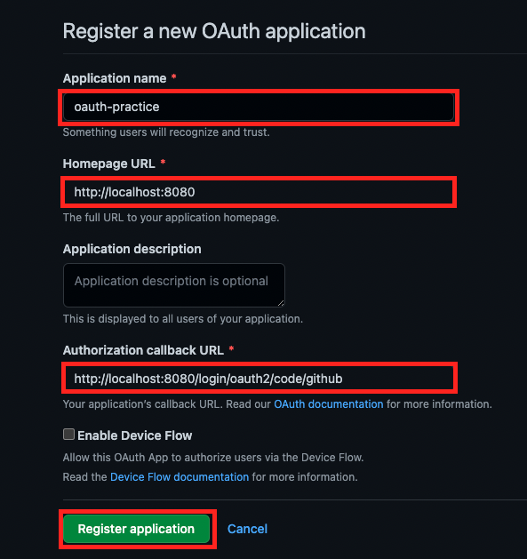
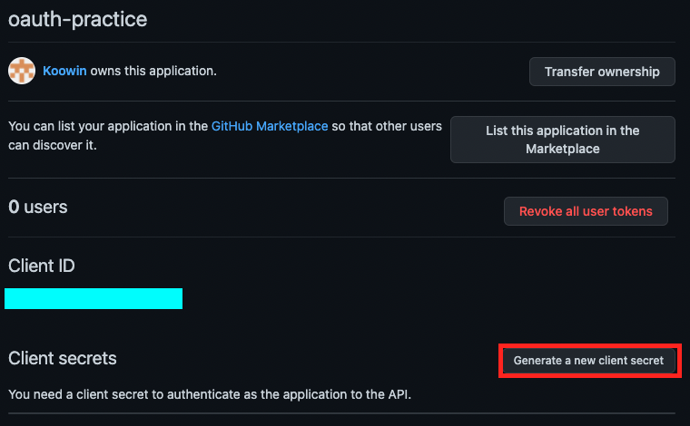
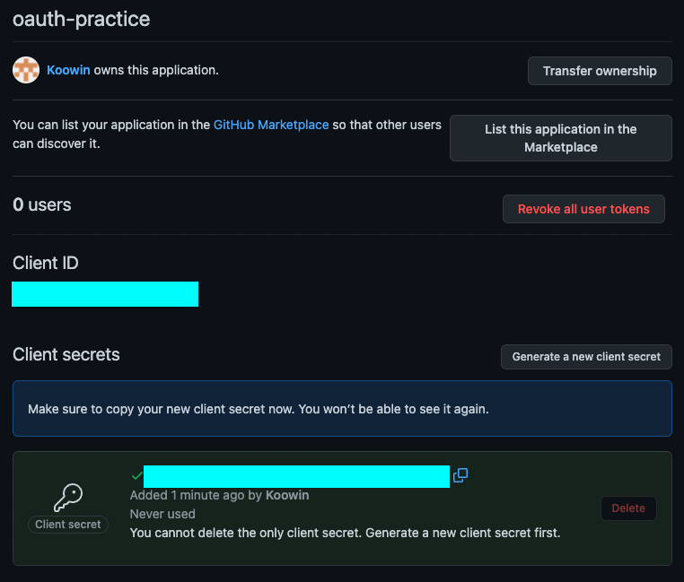

# 개요

최근 시작한 프로젝트에서 소셜 로그인 기능을 담당하게 되었습니다. 동작 원리를 이해한 후, 구현을 하기 위해 여러 예제를 살펴보았으나, 대부분 복잡하여 이해하기 어려워 결국 스프링 튜토리얼로 돌아왔습니다.

OAuth2 동작 원리에 대해서는 구글링해보시면 좋은 자료들이 많습니다. 저는 개인적으로 [쉽게 알아보는 서버 인증 3편(SNS 로그인, OAuth 2.0)](https://tansfil.tistory.com/60) 글이 이해가 잘 되었습니다.

먼저, 소셜 로그인 기능을 이용하기 위해서는 해당 서비스를 제공하는 Github, Google, Naver, Kakao 등에서 클라이언트 키와 비밀번호를 발급받아야합니다.

이 포스트에서는 Github 와 Google 에서 Client ID 와 Client Secret을 발급받는 법을 작성하겠습니다.

# 프로젝트 생성

우선 스프링 프로젝트를 생성해보겠습니다.

다음과 같이 Dependencies 를 추가해줍니다.

# Github OAuth

[Github developer settings](https://github.com/settings/developers) 페이지에 접속합니다.

Register a new application 을 클릭합니다.

필수 항목을 입력하고 Register application 을 클릭합니다. (Application name 은 원하는대로 입력하셔도 됩니다.)

Generate a new client secret 버튼을 클릭합니다.

# Google OAuth

# 출처

* [Building REST services with Spring](https://spring.io/guides/tutorials/rest/)