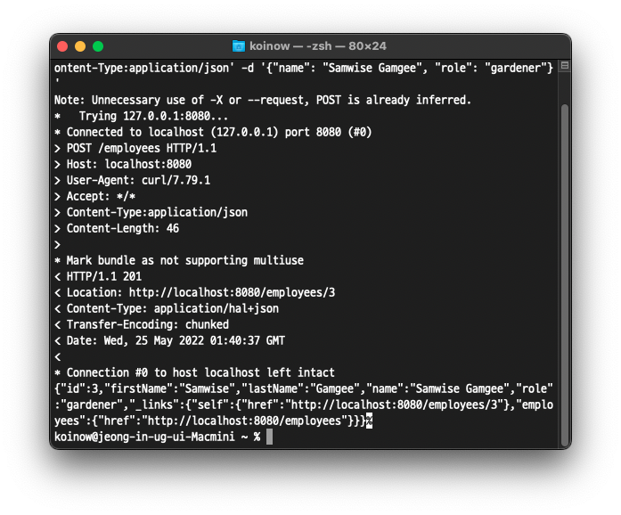
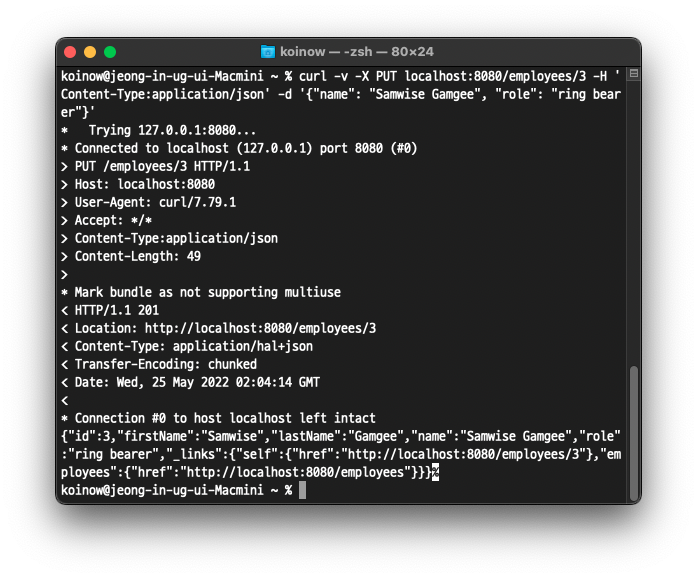
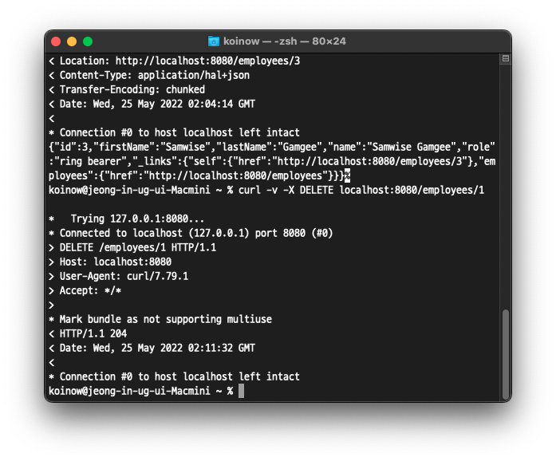

# 개요

튜토리얼을 진행하다보니, 원래 알고 있던 REST API 와는 점점 다른 방향으로 진행되는 것 같아 잠시 중단하였습니다. 그 동안 REST API 란 무엇인가? 에 대해 더 공부하는 시간을 가졌습니다.


# REST

REST API 가 최종적으로 추구하는 것은 효율적이고 확장 가능한 시스템입니다. 변화와 확장에 쉽게 대응할 수 있도록 말이죠.

REST 는 다음 6가지 요구사항을 만족시켜야 합니다.

1. Client-Server
2. Stateless
3. Cache
4. Uniform Interface
   1. identification of resorces
   2. manipulation of resources through representation
   3. self-descriptive messages
   4. hypermedia as the engine of application state
5. Layered System
6. Code on demand (optional)

REST API 라고 검색하면 나오는 보편적으로 알려진 내용과는 많은 차이가 있었습니다. 로이 필딩의 논문에서는 HTTP 를 사용해야 한다, URL 을 명사형으로 사용한다, HTTP Methods 를 통해 명확하게 CRUD 를 명시한다. 등의 내용은 없었습니다.

따라서 이를 RESOURCEful API 로 부르자라는 의견도 찾을 수 있었습니다.

공부하면서 참고한 글들의 링크입니다. REST 를 이해하는데 큰 도움이 되었습니다.

* [REST의 representation이란 무엇인가](https://blog.npcode.com/2017/04/03/rest%EC%9D%98-representation%EC%9D%B4%EB%9E%80-%EB%AC%B4%EC%97%87%EC%9D%B8%EA%B0%80/)
* [바쁜 개발자들을 위한 REST 논문 요약](https://blog.npcode.com/2017/03/02/%eb%b0%94%ec%81%9c-%ea%b0%9c%eb%b0%9c%ec%9e%90%eb%93%a4%ec%9d%84-%ec%9c%84%ed%95%9c-rest-%eb%85%bc%eb%ac%b8-%ec%9a%94%ec%95%bd/)
* [REST 연구 요약본](http://haah.kr/2017/08/05/rest-series-summary/)


# 튜토리얼 진행

> REST is a collection of architectural constraints that when adopted make your application much more resilient. A key factor of resilience is that when you make upgrades to your services, your clients don’t suffer from downtime.

과거에는 서비스를 변경 혹은 추가 할 때, 클라이언트 또한 업데이트가 필요했다고 합니다. 클라이언트는 필연적으로 업데이트를 하느라 서비스를 이용하지 못하는 시간이 발생하게 됩니다.

서비스 중단은 손실로 직결되므로 이 시간을 없애야하고, 도메인이 변경하더라도 과거에 지원하던 API 도 서비스해야합니다.


## 변경 요구사항

도메인 Employee 의 name 필드를 firstName 과 lastName 으로 변경하라.


## 해결 방법

```json
{
  "id": 1,
  "firstName": "Bilbo",
  "lastName": "Baggins",
  "role": "burglar",
  "name": "Bilbo Baggins",
  "_links": {
    "self": {
      "href": "http://localhost:8080/employees/1"
    },
    "employees": {
      "href": "http://localhost:8080/employees"
    }
  }
}
```

튜토리얼에서는 위와 같은 응답을 제공하는 것을 해결책으로 제시하고 있습니다.

firstName, lastName 필드가 생겼지만 여전히 name 필드도 유지가 되고 있습니다. 과거에 제공하던 API 를 이용하던 사용자에게도 동일한 서비스를 제공할 수 있는 것이죠.

# Employee 변경

이전 튜토리얼에서는 lombok 의 getter, setter 메서드를 사용했지만, 변경 된 요구사항을 반영하기 위해서 getName 과 setName 을 명확히 표현해야할 필요가 생겼습니다.

따라서 모든 필드에 대해 getter, setter 메서드를 추가해주고, 특별히 생성자와 getName 과 setName 만 신경써서 수정해주시면 됩니다.

```java
import lombok.ToString;

import javax.persistence.Entity;
import javax.persistence.GeneratedValue;
import javax.persistence.Id;
import java.util.Objects;

@ToString
@Entity         //JPA 기반 저장소에 저장하겠다는 선언
public class Employee {
    private @Id
    @GeneratedValue
    Long id;        //Primary Key
    private String firstName;
    private String lastName;
    private String name;
    private String role;

    public Employee() {
    }

    public Employee(String firstName, String lastName, String role) {
        this.firstName = firstName;
        this.lastName = lastName;
        this.role = role;
    }

    // 기존 API 사용자도 이용할 수 있게 메서드 변경
    public String getName() {
        return this.firstName + " " + this.lastName;
    }

    public void setName(String name) {
        String[] parts = name.split(" ");
        this.firstName = parts[0];
        this.lastName = parts[1];
    }

    public Long getId() {
        return this.id;
    }

    public String getFirstName() {
        return this.firstName;
    }

    public String getLastName() {
        return this.lastName;
    }

    public String getRole() {
        return this.role;
    }

    public void setId(Long id) {
        this.id = id;
    }

    public void setFirstName(String firstName) {
        this.firstName = firstName;
    }

    public void setLastName(String lastName) {
        this.lastName = lastName;
    }

    public void setRole(String role) {
        this.role = role;
    }

    @Override
    public boolean equals(Object o) {
        if (this == o) return true;
        if (o == null || getClass() != o.getClass()) return false;
        Employee employee = (Employee) o;
        return Objects.equals(id, employee.id) && Objects.equals(name, employee.name) && Objects.equals(role, employee.role);
    }

    @Override
    public int hashCode() {
        return Objects.hash(id, name, role);
    }
}

```


# LoadDatabase 수정

Employee 의 생성자가 변경되었으므로 LoadDatabase 도 다음과 같이 firstName 과 lastName 으로 나누어줍니다.

```java
import org.slf4j.Logger;
import org.slf4j.LoggerFactory;
import org.springframework.boot.CommandLineRunner;
import org.springframework.context.annotation.Bean;
import org.springframework.context.annotation.Configuration;

@Configuration
public class LoadDatabase {
    private static final Logger log = LoggerFactory.getLogger(LoadDatabase.class);

    // Spring Boot 는 시작 시 모든 CommandLineRunner 를 시작함
    @Bean
    CommandLineRunner initDatabase(EmployeeRepository repository) {
        return args -> {
            log.info("Preloading " + repository.save(new Employee("Bilbo", "Baggins", "burglar")));
            log.info("Preloading " + repository.save(new Employee("Frodo", "Baggins",  "thief")));
        };
    }
}
```


# EmployeeController 수정 (POST)

POST 방식으로 employee 를 추가해주던 API 메서드를 변경해줄 필요가 생겼습니다.

Spring tutorial 에서 제공하는 코드는 다음과 같습니다.

```java
// POST, localhost:8080/employees -> Employee 한 명 추가
//ResponseEntity : HTTP 201 Created 상태 메시지를 응답한다.
@PostMapping("/employees")
ResponseEntity<?> newEmployee(@RequestBody Employee newEmployee) {
		EntityModel<Employee> entityModel = assembler.toModel(repository.save(newEmployee));
  
	  return ResponseEntity.created(entityModel.getRequiredLink(IanaLinkRelations.SELF).toUri()).body(entityModel);
}
```


ResponseEntity 라는 객체를 이용해 HTTP 201 Created 응답과, Location 헤더에 생성된 Employee 의 URL 을 추가해 줄 수 있습니다.

하지만 name 과 role 만을 가지고 있는 과거 Employee 객체를 이용하여 어떻게 repository.save() 를 할 수 있는지 잘 모르겠습니다. 😭

JPA 에 대한 공부가 더 필요할 것 같아요.


# 결과 확인 (POST)

```bash
$ curl -v -X POST localhost:8080/employees -H 'Content-Type:application/json' -d '{"name": "Samwise Gamgee", "role": "gardener"}'
```

이전 API 를 활용해 Samwise Gamgee 를 추가해보겠습니다.



다음과 같이 Entity 가 수정되었지만 정상적으로 서비스되는 것을 확인할 수 있습니다.

응답의 json 부분만 보기 쉽게 정리해보면 다음과 같습니다.

```json
{
  "id": 3,
  "firstName": "Samwise",
  "lastName": "Gamgee",
  "role": "gardener",
  "name": "Samwise Gamgee",
  "_links": {
    "self": {
      "href": "http://localhost:8080/employees/3"
    },
    "employees": {
      "href": "http://localhost:8080/employees"
    }
  }
}
```


# EmployeeController 수정 (PUT)

PUT 을 관리하는 메서드도 다음과 같이 변경해줍니다. 기존과 큰 차이는 없고, POST 와 비슷하게 HTTP Status 와 Location HEADER 를 지원해주기 위해 ResponseEntity 를 사용합니다.

```java
// PUT, localhost:8080/employees/{id} -> {id} Employee 추가, 수정
@PutMapping("/employees/{id}")
ResponseEntity<?> replaceEmployee(@RequestBody Employee newEmployee, @PathVariable Long id) {
	  Employee updatedEmployee = repository.findById(id)
  		  .map(employee -> {
     			 employee.setName(newEmployee.getName());
     			 employee.setRole(newEmployee.getRole());
				return repository.save(employee);
        })
		    .orElseGet(() -> {
    			  newEmployee.setId(id);
			      return repository.save(newEmployee);
		    });

  	EntityModel<Employee> entityModel = assembler.toModel(updatedEmployee);
  	return ResponseEntity.created(entityModel.getRequiredLink(IanaLinkRelations.SELF).toUri()).body(entityModel);
}
```


# 결과 확인 (PUT)

결과 반영을 위해 서버를 재시작 하였다면 위의 결과 확인 (POST) 에서 수행한 명령어를 통해 3번 Employee 를 먼저 추가해주세요.

다음과 같이 3번 employee 의 role 을 ring bearer 로 수정합니다.

```bash
$ curl -v -X PUT localhost:8080/employees/3 -H 'Content-Type:application/json' -d '{"name": "Samwise Gamgee", "role": "ring bearer"}'
```




결과가 잘 출력되는 것을 확인하였습니다.

# EmployeeController 수정 (DELETE)

DELETE 를 담당하는 메서드도 수정해주겠습니다.

```Java
// DELETE, localhost:8080/employees/{id} -> {id} Employee 삭제
@DeleteMapping("/employees/{id}")
ResponseEntity<?> deleteEmployee(@PathVariable Long id) {
		repository.deleteById(id);

		//204 No Content 를 반환함
		return ResponseEntity.noContent().build();
}
```


# 결과 확인 (DELETE)

1번 Employee 를 삭제해보겠습니다.

```bash
$ curl -v -X DELETE localhost:8080/employees/1
```



정상적으로 처리되고 HTTP 204 (No Content) 응답이 반환된 것을 확인할 수 있습니다.

# 출처

* [Building REST services with Spring](https://spring.io/guides/tutorials/rest/)