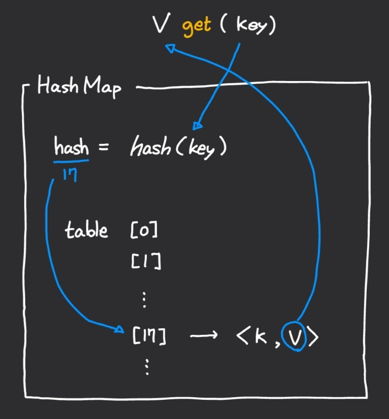

#   📜 목차

- 코딩 테스트
  - 프로그래머스 - 오픈채팅방 (Lv.2)
- 개인 발표
  - Hash Map
  - ...


# 🎯 코딩 테스트

## 프로그래머스: 오픈채팅방 (Lv.2) [[링크]](https://programmers.co.kr/learn/courses/30/lessons/42888)

### 나의 풀이

```java
import java.util.*;

class Solution {

    private HashMap<String, String> nameOfUid = new HashMap<>();
    private ArrayList<MsgLog> msgLogs = new ArrayList<>();

    public String[] solution(String[] record) {
        for (String message : record) {
            String[] arr = message.split(" ");
            switch (arr[0].charAt(0)) {
                case 'E':
                    msgLogs.add(new MsgLog(true, arr[1]));
                    nameOfUid.put(arr[1], arr[2]);
                    break;
                case 'L':
                    msgLogs.add(new MsgLog(false, arr[1]));
                    break;
                default:
                    nameOfUid.put(arr[1], arr[2]);
                    break;
            }
        }
        int size = msgLogs.size();
        String[] answer = new String[size];

        for (int i = 0; i < size; i++) {
            answer[i] = msgLogs.get(i).toString();
        }

        return answer;
    }

    class MsgLog {
        private final boolean isEnter;
        private final String uid;

        MsgLog(boolean isEnter, String uid) {
            this.isEnter = isEnter;
            this.uid = uid;
        }

        public String toString() {
            String returnVal = nameOfUid.get(this.uid) + "님이 ";
            final String[] actions = {"들어왔습니다.", "나갔습니다."};

            if (this.isEnter) {
                return returnVal + actions[0];
            } else {
                return returnVal + actions[1];
            }
        }
    }
}
```


# 📝 개인 발표

## HashMap

### Map Collection

Map 컬렉션은 키(key)와 값(Value)로 구성된 `Entry<K, V>` 객체를 저장하는 구조입니다.

키는 중복 저장을 허용하지 않지만 값은 중복 저장을 허용합니다. 따라서 기존에 저장된 키와 동일한 키로 새로운 값을 저장하면 기존 값은 없어지고 새로운 값으로 대체됩니다.


### Map Methods

Map.java에 구현된 Map 인터페이스의 주요 메서드와 설명입니다.

| Method                                                       | Description                                                  |
| ------------------------------------------------------------ | ------------------------------------------------------------ |
| int <span style="color:orange">size</span>();                | 저장된 모든 키의 수를 리턴                                   |
| boolean <span style="color:orange">isEmpty</span>();         | Map이 비어있는지 여부를 리턴                                 |
| boolean <span style="color:orange">containsKey</span>(Object key); | 주어진 키가 있는지 여부를 리턴                               |
| boolean <span style="color:orange">containsValue</span>(Object value); | 주어진 값이 있는지 여부를 리턴                               |
| V <span style="color:orange">get</span>(Object key);         | 주어진 키의 값을 리턴                                        |
| V <span style="color:orange">put</span>(K key, V value);     | 주어진 키와 값 쌍을 저장. 동일한 키의 이전 값을 리턴(없다면 null) |
| V <span style="color:orange">remove</span>(Object key);      | 주어진 키의 값을 삭제하고 해당 값을 리턴                     |
| Set<K> <span style="color:orange">keySet</span>();           | 모든 키를 Set 객체에 담아 리턴                               |
| Collection<V> <span style="color:orange">values</span>();    | 모든 값을 Collection 객체에 담아 리턴                        |
| Set<Map.Entry<K, V>> <span style="color:orange">entrySet</span>(); | 모든 키와 값 쌍을 Set 객체에 담아 리턴                       |


### HashMap

AbstractMap에 구현 된 <span style="color:orange">get</span> 메서드는 기본적으로 Iterator를 이용하여 entrySet을 처음부터 하나씩 조회합니다.


따라서 키를 이용하여 값을 조회하는데 O(n) 시간이 걸립니다. HashMap은 키를 이용한 값 조회시간을 단축시키기 위해 사용되는 Map 인터페이스를 구현한 Java API 입니다. HashMap을 이용하면 값을 조회하는데 보통 O(1) 시간이 걸립니다. 


#### 🟡 Hash function

해시 함수는 임의의 길이를 갖는 임의의 데이터를 고정된 길이의 데이터로 매핑하는 함수를 말합니다.

쉽게 설명하면, Java의 HashMap은 각 객체의 Map 인터페이스에 정의된 `int hashCode()` 메서드가  반환하는 값을 사용하여 배열처럼 값을 조회합니다.




hashCode()의 반환형은 int이므로 이론상 최대 2^32개 이하의 키 객체는 완전해시함수를 이용해 중복없이 저장할 수 있습니다. 하지만 키 객체의 개수가 2^32를 초과하거나, 서로 다른 객체임에도 hashCode()를 통해 생성된 해시값이 동일한 경우는 해시 충돌이 발생하게 됩니다. 해시 충돌에 대해서 더 궁금하시다면 같이보면 좋은 문서들의 "Java HashMap은 어떻게 동작하는가?"를 참고해주세요.


#### 🟡 hashCode, equals 메서드 재정의

위에서 언급한 hashCode() 메서드는 각 객체에서 재정의할 수 있습니다.

학번과 이름을 필드로 가지는 다음과 같은 객체가 있다고 해보겠습니다.

```java
class Student{
	public int sno;
	public String name;
    
    public Student(int sno, String name){
        this.sno = sno;
        this.name = name;
    }
}
```

다음과 같이 학생 객체와 매핑되는 수학 점수를 HashMap으로 저장하고 싶습니다.

```java
HashMap<Student, Integer> hashMap = new HashMap<>();
hashMap.put(new Student(12, "철수"), 80);
hashMap.put(new Student(12, "철수"), 95);		//철수의 점수 업데이트
```

제가 의도한대로 철수의 점수가 업데이트 되었을까요?

두 번의 put에서 생성한 객체의 주소가 다르기 때문에 업데이트 되지 않고 각각 따로 저장되었습니다.


이러한 문제점을 해결하기 위해 equals() 메서드와 hashCode() 메서드를 재정의 할 수 있습니다.

```java
public int hashCode(){
    return sno + name.hashCode();
}

public boolean equals(Object obj){
    if(obj instanceof Student){
        Student student = (Student) obj;
        return (sno==student.sno) && (name.equals(student.name));
    }
    else{
        return false;
    }
}
```

위와 같이 Student 클래스 내에 hashCode와 equals를 재정의하여 같은 객체로 보고 값을 업데이트하도록 할 수 있습니다.


### 참고한 문서들

1. 📄Java HashMap은 어떻게 동작하는가? [[링크]](https://d2.naver.com/helloworld/831311)

2. 📖신용권, 『혼자 공부하는 자바』

### HashMap 관련 코테 문제들

- 프로그래머스: 완주하지 못한 선수 (Lv.1) [[링크]](https://programmers.co.kr/learn/courses/30/lessons/42576)
- 프로그래머스: 오픈채팅방 (Lv.2) [[링크]](https://programmers.co.kr/learn/courses/30/lessons/42888)

✏추가 예정

