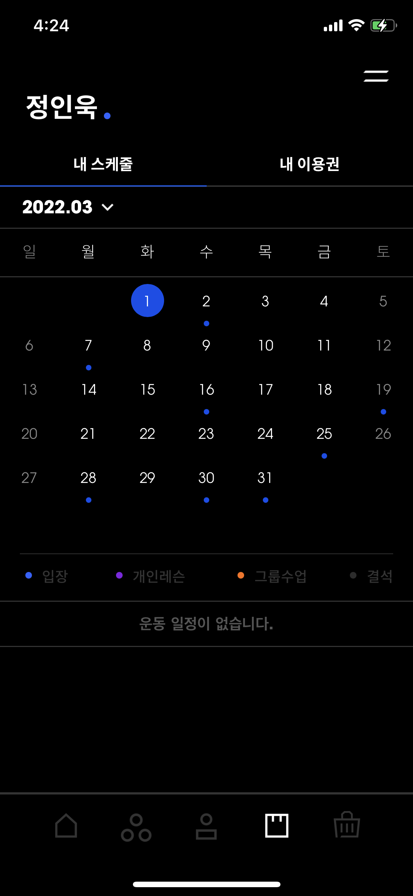

# 목표 달성률

3~5월 운동 기록입니다. 3월에는 불규칙적으로 나갔지만, 4월부터는 많이 아팠던 주를 제외하고는 주 4일을 달성했습니다.

5월 4일, 이 헬스장에서 마지막 운동을 마치고 5월 9일부터는 새로운 헬스장에서 운동을 시작합니다.

# 몸무게 변화 및 느낀점

몸무게는 77kg -> 77.75kg 으로 오히려 증가하였습니다. 운동은 열심히 다녔는데 오히려 살이 쪘네요. 근육은 점점 붙고있는 느낌이 듭니다. 근육량이 늘어서 몸무게가 느는 것이라고 위안을 삼아야할 것 같습니다.